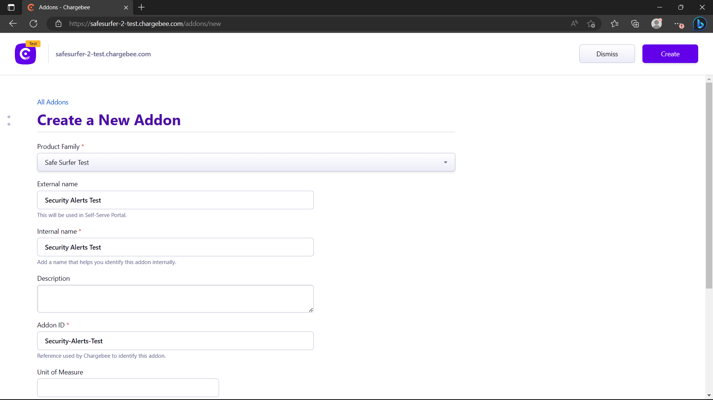
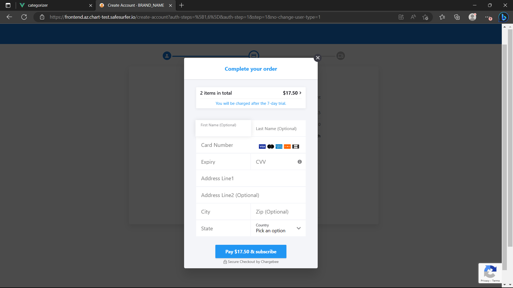

# Billing and quotas
The Safe Surfer deployment supports several different ways of restricting accounts based on their billing status:
- Integrating with [Chargebee](https://chargebee.com) to handle billing within the Safe Surfer deployment.
- Setting subscription status per user using the courtesy subscription API. You can use this to make the status for each user match your own.
- Modifying usage quotas based on the current subscription status, plan, or addons.
- Modifying usage quotas per user manually using the API.

## Chargebee billing
To try out chargebee billing, you can [create a free test instance](https://www.chargebee.com/trial-signup/). Chargebee handles many different billing gateways and provides a framework and UI to work with every aspect of selling subscriptions or products.

After creating a test instance, you should be prompted to set up some products. You can proceed with this if you like, but we'll create our own ones in this tutorial.

To integrate Safe Surfer with Chargebee, first [create an API key](https://www.chargebee.com/docs/2.0/api_keys.html). Make sure it's a "Full Access" key. Then, add the key and your chargebee site to your `values.yaml`. At the same time, create a strong password which we'll use to set up the webhook next:

```yaml
api:
  accounts:
    chargebee:
      site: example-test # for example-test.chargebee.com
      apiKey: my-api-key
      webhookPassword: generate-a-strong-password
```

Make sure to upgrade the helm chart. Then, [create a webhook](https://www.chargebee.com/docs/2.0/webhook_settings.html) on Chargebee. The `Webhook URL` should be `https://api.ss.example.com/v2/webhooks/user-subscription`, changing `api.ss.example.com` to your own API domain. You should `Protect webhook URL with basic authentication`, then use the `webhookPassword` from your values as the password. Select `Version 2`, set as primary, then select all subscription-related events to be sent. Once done, it should look something like this:


You can now test the webhook. You'll most likely get a 500 response because the events don't necessarily exist, but the `Response received` should look something like the following:

```
Headers
 HTTP/1.1 500 Internal Server Error
Date: Tue, 28 Mar 2023 03:11:38 GMT
Content-Type: application/json
Content-Length: 115
Connection: keep-alive
Vary: Origin
Strict-Transport-Security: max-age=15724800; includeSubDomains
 
Body
 {"meta":{"timestamp":1679973098,"code":500,"errorCode":"","message":"Couldn't post user subscription"},"spec":null}
```

> **Warning**
> To reduce the amount of requests made to Chargebee's API, the API caches product catalog resources such as plans and addons. After modifying a plan or addon, you should re rollout the API, e.g. `kubectl rollout restart deployment safesurfer-api`. Changing the `planConfig` in your `values.yaml` will automatically do this for you.

Now we can start creating a plan and addons. Create a new product family named `Safe Surfer Test`:


Then, create a new plan named `Safe Surfer Test`:


Then, select any price point to set a price:


Then, select your new price point:


Then, create an addon:



Then, create a price point for the addon. Ensure there is a matching currency and billing period between the plan and the addon, or the addon cannot be attached to the plan.


> **Note**
> The `Flat Fee` option for addons is not supported. To create an on/off addon, you can simply set a `maxQuantity` of `1`.

Now it's time to sign a customer up to the plan. We have a couple of choices here:
- Use the Chargebee APIs or integrations to create a customer signed up to the plan. Just create the customer with an ID matching that of their Safe Surfer account ID, and as long as the webhooks are set up, they will receive it. ([Webhook method](./billing-and-quotas.md#webhook-method))
- Use the Safe Surfer Billing APIs to create the subscription for them directly. ([API method](./billing-and-quotas.md#api-method))

We'll look at both approaches in the next section.

### API method
To allow using the new plan and addon from the API, we'll need to add them to our `values.yaml` like so. In the following example, we will set up the quotas so that no devices can be created until the user has an active plan. The addon will allow the user to use [AlphaSOC](./alphasoc.md) Security Alerts in various quantities.

```yaml
api:
  # Don't allow creating devices by default
  quotas:
    devices:
      maxValue: 0
    client_devices:
      maxValue: 0
    security_alert_endpoints_per_hour:
      maxValue: 0
  accounts:
    chargebee:
      planConfig:
        plans:
          # If the user has this active plan, allow creating devices and client devices
          Safe-Surfer-Test:
            enabled: true
            quotas:
              devices:
                maxValue: 10
              client_devices:
                maxValue: 1000
            addons:
            - Security-Alerts-Test
        addons:
          # If the user has this addon, allow using 1 unit of security alerts per addon amount
          Security-Alerts-Test:
            enabled: true
            quotas:
              security_alert_endpoints_per_hour:
                valueDelta: 1
            maxQuantity: 100
            prorateOnUpgrade: true
            prorateOnDowngrade: true
            invoiceImmediately: true
            title: 'Security Alerts'
            description: 'The amount of devices to scan for Security Alerts. Provided by AlphaSOC.'
            icon: 'bug'
```

Then upgrade the chart. We will show two ways of creating the subscription/addons for the user:
- Interacting with the API directly
- Using the frontend

Let's create a new user to try the API approach with. Use the admin app to create one. Remember that you can add e.g. `+2` after your name to create a separate account while routing emails towards the same account:


You can find the user ID using the `Browse` tab:


#### Using the API directly
Obtain an auth token for the user. If your accounts are still set to `managed`, use the method described [here](./per-user-and-device-filtering.md). If your accounts aren't managed, you can use the [regular signin API](https://safesurfer.gitlab.io/api-docs/#section/Safe-Surfer-API-Docs/Authentication). We will use the `$BILLING_AUTH_TOKEN` variable below as a placeholder for the auth token.

To preview the costs associated with creating the subscription, call the estimate endpoint:

```sh
$ curl "$SS_API_ADDR/v2/user/subscription/estimate" -d '{"planID": "Safe-Surfer-Test", "planPriceID": "Safe-Surfer-Test-USD-Monthly", "addons": [{"id": "Security-Alerts-Test", "quantity": 5}]}' -H "Authorization: Bearer $BILLING_AUTH_TOKEN" | jq
```
```json
{
  "meta": {
    "timestamp": 1680129315,
    "code": 201,
    "errorCode": "",
    "message": "OK"
  },
  "spec": {
    "immediateCosts": null,
    "nextRenewalCosts": {
      "total": 12.5,
      "totalDiscount": 0,
      "items": [
        {
          "name": "Safe Surfer Test",
          "cost": 7.5,
          "discount": 0
        },
        {
          "name": "Security Alerts Test",
          "cost": 5,
          "discount": 0
        }
      ],
      "discountValidOnce": false,
      "discountValidUntil": null
    },
    "unbilledCharges": null,
    "quotas": {
      "alert_emails": {
        "maxValue": 10,
        "currentValue": 2,
        "imposedBy": "plan"
      },
      "alerts_dismissed": {
        "maxValue": 5000,
        "currentValue": 0,
        "imposedBy": "default"
      },
      "cast_events": {
        "maxValue": 0,
        "currentValue": 0,
        "imposedBy": "default"
      },
      "client_devices": {
        "maxValue": 1000,
        "currentValue": 0,
        "imposedBy": "plan"
      },
      "custom_rules_domain_list_per_device": {
        "maxValue": 1000,
        "currentValue": 0,
        "imposedBy": "default"
      },
      "devices": {
        "maxValue": 10,
        "currentValue": 0,
        "imposedBy": "plan"
      },
      "evasion_attempts": {
        "maxValue": 1000,
        "currentValue": 0,
        "imposedBy": "default"
      },
      "logged_notifications": {
        "maxValue": 0,
        "currentValue": 0,
        "imposedBy": "default"
      },
      "router_diagnostics_reports": {
        "maxValue": 10,
        "currentValue": 0,
        "imposedBy": "default"
      },
      "screencasts": {
        "maxValue": 0,
        "currentValue": 0,
        "imposedBy": "default"
      },
      "screentime_deadlines_per_device": {
        "maxValue": 10,
        "currentValue": 0,
        "imposedBy": "default"
      },
      "screentime_timers_per_device": {
        "maxValue": 10,
        "currentValue": 0,
        "imposedBy": "default"
      },
      "screentime_timetables_per_device": {
        "maxValue": 10,
        "currentValue": 0,
        "imposedBy": "default"
      },
      "security_alert_endpoints_per_hour": {
        "maxValue": 5,
        "currentValue": 0,
        "imposedBy": "plan"
      },
      "security_alert_ignore_rules": {
        "maxValue": 1000,
        "currentValue": 0,
        "imposedBy": "default"
      },
      "vpn_attempts": {
        "maxValue": 20000,
        "currentValue": 0,
        "imposedBy": "default"
      },
      "web_push_subscriptions": {
        "maxValue": 0,
        "currentValue": 0,
        "imposedBy": "default"
      }
    }
  }
}
```

The main thing of interest here is `nextRenewalCosts`, which shows the costs of the user's next bill after signing up. If the plan had no trial period, `immediateCosts` would be filled out instead.

Now that we've previewed the costs, we can create the subscription:

```sh
$ curl "$SS_API_ADDR/v2/user/subscription" -d '{"chargebee": {"planID": "Safe-Surfer-Test", "planPriceID": "Safe-Surfer-Test-USD-Monthly", "addons": [{"id": "Security-Alerts-Test", "quantity": 5}]}}' -H "Authorization: Bearer $BILLING_AUTH_TOKEN" | jq
```
```json
{
  "meta": {
    "timestamp": 1680129879,
    "code": 201,
    "errorCode": "",
    "message": "OK"
  },
  "spec": null
}
```

You should now be able to view the current subscription status:

```sh
$ curl "$SS_API_ADDR/v2/user/subscription" -H "Authorization: Bearer $BILLING_AUTH_TOKEN" | jq
```
```json
{
  "meta": {
    "timestamp": 1680130314,
    "code": 200,
    "errorCode": "",
    "message": "OK"
  },
  "spec": {
    "isActive": true,
    "status": "TRIAL",
    "nextBill": 1680738515,
    "canSubscribeChargebee": true,
    "canSubscribeGooglePlay": false,
    "chargebeeSubscription": {
      "id": "284c33be-af39-4bc5-a16d-5a82134e45fb",
      "planId": "Safe-Surfer-Test",
      "planPriceId": "Safe-Surfer-Test-USD-Monthly",
      "createdAt": 1680130115,
      "nextBillingAt": 1680738515,
      "trialEnd": 1680738515,
      "cancelledAt": 0,
      "cancelReason": "",
      "currentTermEnd": 0,
      "startDate": 0,
      "customerCardStatus": "no_card",
      "status": "in_trial",
      "addons": [
        {
          "id": "Security-Alerts-Test",
          "planPriceId": "",
          "quantity": 5,
          "updatable": true,
          "minQuantity": null,
          "maxQuantity": null,
          "prorateOnUpgrade": true,
          "prorateOnDowngrade": true,
          "invoiceImmediately": true
        }
      ]
    },
    "chargebeePlan": {
      "enabled": true,
      "id": "Safe-Surfer-Test",
      "priceID": "Safe-Surfer-Test-USD-Monthly",
      "name": "Safe Surfer Test",
      "channel": "web",
      "price": {
        "price": "$7.50 USD",
        "period": "per month",
        "currencySymbol": "$",
        "currencyCode": "USD",
        "numericPrice": 7.5
      },
      "trial": {
        "trial": "7 day free trial",
        "trialPeriod": 7,
        "trialPeriodUnit": "day"
      },
      "anyPlanQuotas": {
        "alert_emails": {
          "maxValue": null,
          "valueDelta": 10
        }
      },
      "anyCbPlanQuotas": null,
      "planQuotas": {
        "client_devices": {
          "maxValue": 1000,
          "valueDelta": null
        },
        "devices": {
          "maxValue": 10,
          "valueDelta": null
        }
      },
      "addons": [
        {
          "id": "Security-Alerts-Test",
          "priceID": "Security-Alerts-Test-USD-Monthly",
          "name": "Security Alerts Test",
          "price": {
            "pricingModel": "per_unit",
            "priceAndPeriod": {
              "price": "$1.00 USD",
              "period": "per month",
              "currencySymbol": "$",
              "currencyCode": "USD",
              "numericPrice": 1
            },
            "pricingTiers": null
          },
          "quotas": {
            "security_alert_endpoints_per_hour": {
              "maxValue": null,
              "valueDelta": 1
            }
          },
          "minQuantity": null,
          "maxQuantity": null,
          "prorateOnUpgrade": true,
          "prorateOnDowngrade": true,
          "invoiceImmediately": true
        }
      ]
    },
    "nextChargebeeInvoice": {
      "total": 12.5,
      "totalDiscount": 0,
      "items": [
        {
          "name": "Safe Surfer Test",
          "cost": 7.5,
          "discount": 0
        },
        {
          "name": "Security Alerts Test",
          "cost": 5,
          "discount": 0
        }
      ],
      "discountValidOnce": false,
      "discountValidUntil": null
    },
    "googlePlaySubscription": null
  }
}
```

You can also use the API to obtain [hosted pages](https://apidocs.chargebee.com/docs/api/hosted_pages) for editing payment information or checkout.

E.g. for checkout:

```sh
$ curl "$SS_API_ADDR/v2/user/subscription/chargebee/redirect/checkout" -H "Authorization: Bearer $BILLING_AUTH_TOKEN" | jq
```
```json
{
  "meta": {
    "timestamp": 1680130426,
    "code": 200,
    "errorCode": "",
    "message": "OK"
  },
  "spec": {
    "id": "xxxxxxxxxxxxxxxxxxxxxxxxxxxxxxxxxx",
    "type": "checkout_existing",
    "url": "https://example.chargebee.com/pages/v3/xxxxxxxxxxxxxxxxxxxxxxxxxxxxxxxxxx/",
    "state": "created",
    "failure_reason": "",
    "pass_thru_content": "",
    "embed": false,
    "created_at": 1680130426,
    "expires_at": 1680141226,
    "content": null,
    "updated_at": 1680130426,
    "resource_version": 1680130426500,
    "checkout_info": null,
    "business_entity_id": "",
    "object": "hosted_page"
  }
}
```

Or for payment methods:

```sh
$ curl "$SS_API_ADDR/v2/user/subscription/chargebee/redirect/payment-methods" -H "Authorization: Bearer $BILLING_AUTH_TOKEN" | jq
```
```json
{
  "meta": {
    "timestamp": 1680130625,
    "code": 200,
    "errorCode": "",
    "message": "OK"
  },
  "spec": {
    "id": "xxxxxxxxxxxxxxxxxxxxxxxxxxxxxxxxxx",
    "type": "manage_payment_sources",
    "url": "https://example.chargebee.com/pages/v3/xxxxxxxxxxxxxxxxxxxxxxxxxxxxxxxxxx/",
    "state": "created",
    "failure_reason": "",
    "pass_thru_content": "",
    "embed": false,
    "created_at": 1680130625,
    "expires_at": 1680566225,
    "content": null,
    "updated_at": 1680130625,
    "resource_version": 1680130625081,
    "checkout_info": null,
    "business_entity_id": "",
    "object": "hosted_page"
  }
}
```

You can visit the `url` directly to see how they look, or the whole `spec` object can be passed to the [chargebee.js](https://www.chargebee.com/checkout-portal-docs/api.html#chargebee-instance-object) library as the `hostedPage` parameter to show it as a modal, which is what the default frontend does.

#### Using the frontend
To allow the frontend to create subscriptions, we'll need to tell it which plan and price to use. Overwrite the following in your `values.yaml`:

```yaml
api:
  accounts:
    chargebee:
      defaultPlan: Safe-Surfer-Test
      defaultPriceId: Safe-Surfer-Test-USD-Monthly
```

Then upgrade the release. Now we have a couple of choices:
- View the subscription for an existing user. Recommended if you're using managed accounts, or if you just completed the API guide above, you can sign in as the same user.
- Create a user with a new subscription.

##### Existing user
Log in as the existing user:


Hit the trial button in the top right to get to the subscription menu. Then, hit "Change Plan".


Now you can proceed to the `Checkout screen` section below. By going through the checkout again, you'll be testing a resubscribe. Resubscribe can be used to change plans, but in this case we'll just use the same plan again.

##### New user
To be able to create a new user, you'll want to make sure managed accounts are disabled, and you may want to set the `newAccountPolicy` to prevent free creation of accounts. If you'll be using managed accounts, you can skip this guide section. The yaml is as follows:

```yaml
api:
  accounts:
    managed: false
    newAccountPolicy: RequireApproval
```

After upgrading the release, you should be able to create a new user from the frontend, then approve them from the admin app:


#### Checkout screen
After completing either above section, you should see a checkout screen for the plan you added in the `values.yaml`. To add different plan choices, or decorate this screen more, you can fork and build the [user dashboard](https://gitlab.com/safesurfer/dashboard)

Add the addon if you like:


Enter card details. Click the `Card Number` field to autocomplete test cards. You will not be charged, since this is a chargebee test instance.



After completing the checkout, your subscription screen should look something like this:


You can modify the addon, cancel, edit payment methods, etc. Note that since we have set `prorateOnUpgrade` and `invoiceImmediately` in the addon config, adding or upgrading the `Security Alerts` addon will result in a checkout appearing. However, this will not happen if the subscription is still in trial. To play around with this, you can end the trial for the subscription manually in chargebee:


> **Note**
> If you have a `Future` subscription because you resubscribed in the above section, the relevant button will be called `Edit Start Date` instead.

Then, refresh the frontend and `Edit` the Security Alerts addon to increase the quantity:


After hitting `Confirm`, you should now see an immediate charge be raised:


This is because `prorateOnUpgrade` and `invoiceImmediately` are both `true` for this addon. Configuring the addon this way ensures users can't use it for free by removing it before the end of the current billing period *or* cancelling before the end of the current billing period. If the user later reduces the quantity, they will receive credits that will be applied to the next invoice, but they will always pay a fair amount for the duration they use the addon. For example, if we now reduce the addon quantity to lower than it was before, the user will receive credits towards their next invoice:


If `invoiceImmediately` was set to `false`, users will still receive a prorated charge/credits, but it will be added to their next invoice. Therefore users can dodge payment, but only by cancelling or refusing payment entirely.

If `prorateOnUpgrade` was set to `false`, users will get to use the addon for free until the next billing period. Users can dodge payment by removing the addon before the invoice is generated.

### Webhook method
You'll need to create a new user to try the webhook approach with. Use whichever method you prefer, like the instructions above.

Then, create a customer on chargebee with the same ID. You only need to fill out the `Customer ID` field.


Then, create a subscription from the `Subscriptions` menu and select your new customer and plan.


Now you can search for the user again on the admin app, and you should see the new subscription status and plan:


> **Note**
> Webhooks are asynchronous and usually complete instantly, but there is no guarantee on speed provided by Chargebee. You may have to wait a couple of minutes. To ensure the subscription is added instantly, use the API method below.

You can also view the new subscription on the user dashboard. Sign in as your new user and navigate to `Account Settings -> Subscription` to view it. It should look something like this:


> **Note**
> Some dashboard subscription operations won't work until you configure the plans and addons. See the above section.

## Manual/custom billing
The admin app has APIs to support [changing the subscription status of users manually](https://safesurfer.gitlab.io/admin-app-api-docs/#tag/users/operation/postCourtesySubscription), or [editing quotas](https://safesurfer.gitlab.io/admin-app-api-docs/#tag/users/operation/putUserQuotaGrant).

### Manual Billing
You can manually grant a user an active subscription by using the "Courtesy Account" feature. In the GUI (or API), search for a user, then grant them a courtesy account:


Now you can use `api.accounts.anyPlanConfig` or `api.accounts.courtesyPlanConfig` to configure quotas for any users with an active subscription, or courtesy subscription specifically.

### Editing Quotas
Search for any user in the admin app, select the dropdown, then select "View/Edit Quotas". As an example, if you followed the guide above, a user with the relevant plan and addon would look something like this:


The user has several quotas defined by their plan. You can, however, use the API or GUI to the same effect by updating the value manually. For example, let's allow 20 devices:


Now this will override the default or any `plan` values:


## Paywalling API endpoints
You can set the API to return 403 on certain API endpoints if the requesting user doesn't have an active subscription. Look up the endpoint ID of the endpoint you wish to restrict on the API docs, then add something like the following:

```yaml
api:
  routesConfig:
    "172": # GET /v2/alerts
      paywall: true
```
