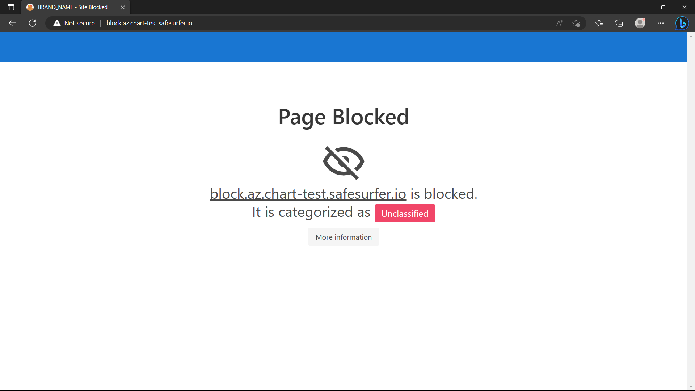

# Block Page
Setting up a block page shows your users when a website has been blocked, rather than just failing the request. As observed in the Getting Started guide, when a block page isn't set up, DNS requests to blocked domains will time out. There are two choices for fixing this:
1. Reply with NXDOMAIN when a domain is blocked.
2. Host the block page, which will show a message and category for the domain in the user's browser, unless the blocked site is using HSTS or the browser otherwise expects HTTPS. Users can use the API to choose NXDOMAIN for their account if they prefer it.

## Using NXDOMAIN
To use this method, just add the following snippet to your `values.yaml` and upgrade the release:
```yaml
blockpage:
  domain: ''
  enabledForUsersByDefault: false
```

This works for either the Helm chart or `ss-config` values.

## Using the block page
To CNAME to any other page, e.g. one hosted elsewhere, just add the domain in the same way as above:
```yaml
blockpage:
  # Any domain you like
  domain: block.example.com
```

To host the block page as part of this release, enable it:
```yaml
blockpage:
  enabled: true
  domain: block.ss.example.com
```

This requires [cert-manager](https://cert-manager.io) to be installed as described in the [ingress and cert setup](./ingress-and-cert-setup.md) guide.

However, the block page only generates a self-signed cert, as HTTPS will never be valid because the block page is served as whichever domain is blocked, rather than its own domain.

Deploying the block page now will result in another unique external IP being created, since, due to the same constraint as above, the ingress cannot be used. The block page needs its own external IP.

Deploy the new block page (`helm upgrade "safesurfer" "safesurfer/safesurfer" -f values.yaml`), then watch `kubectl get service -w` until the IP for the block page service is ready. It should look something like this:

```
NAME                        TYPE           CLUSTER-IP     EXTERNAL-IP     PORT(S)                      AGE
safesurfer-block-page       LoadBalancer   10.0.201.163   xx.xxx.xxx.xx   80:31518/TCP,443:30125/TCP   36s
```

Now you can create a DNS entry for the domain of your block page (should match `blockpage.domain`) pointing to the new external IP address.

For the block page to function properly, it is required that the `categorizer.adminApp` should have an ingress enabled. This is because the block page uses the [public search](https://safesurfer.gitlab.io/admin-app-api-docs/#tag/domains/operation/getPublicSearch) API endpoint of the admin app to determine the category of the website the user has been blocked from. This would not be possible to host on the user API, because that enforces CORS. The admin app has no need to enforce CORS because all non-public endpoints require username/password authentication, and optionally an IP whitelist. After enabling the `categorizer.adminApp.ingress` according to [ingress and cert setup](./ingress-and-cert-setup.md), the block page will automatically connect to the hostname you specify for the ingress. With the admin app ingress enabled, you can use the `categorizer.adminApp.authIpWhitelist` parameter to enhance its security while preserving the functionality of the block page.

Once the admin app ingress has been enabled and any DNS entries have propagated, you should be able to enter the domain or IP address of your block page in your browser to view it. The default block page is unbranded and should look something like this:



You can update the category of the block page domain in the admin app to get it to show something different, but there's no requirement to.

You will want to make some branding changes to the block page before using it in production. The block page is open source, you can fork it [here](https://gitlab.com/safesurfer/block-page).

### Troubleshooting
- If the page looks blank, check the browser console to see if there was an error accessing the API.
