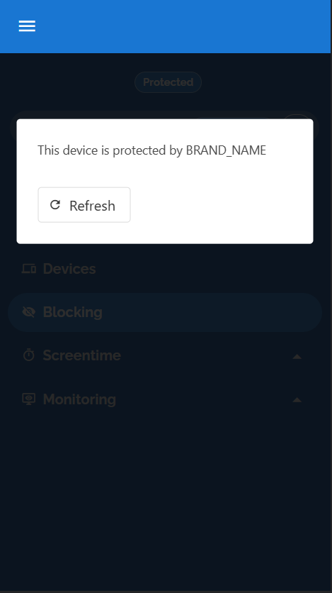

# Checking protection
It's sometimes useful to be able to check whether users are connected to the Safe Surfer DNS or not. To provide this functionality, you can enable the `protocolchecker`. Add something like the following to your `values.yaml`:

```yaml
protocolchecker:
  enabled: true
  domains:
    base: check.ss.example.com
    active: active # active.check.ss.example.com
    plain: plain # active.check.ss.example.com
    dnscrypt: dnscrypt # dnscrypt.check.ss.example.com
    doh: doh # doh.check.ss.example.com
    dot: dot # dot.check.ss.example.com
    router: router # router.check.ss.example.com
```

Ensure you create a DNS entry for your equivelant of `active.check.example.com` pointing to your ingress's IP address.

> **Note**
> It isn't possible to complete this guide when using KIND/minikube.

Obtaining a valid certificate for the protocol checker can be trickier than the other deployments, since the domains you define here don't exist on the public internet (apart from `active.check.example.com`). So you will have to use one of the other methods as shown in [ingress and cert setup](./ingress-and-cert-setup.md). Place the TLS configuration inside `protocolchecker.tls`.

If you are using a wildcard TLS setup, you may like to change the above to something like the following:

```yaml
protocolchecker:
  enabled: true
  domains:
    base: ss.example.com # Your domain here
    active: active-check # active-check.ss.example.com
    plain: plain-check # active-check.ss.example.com
    dnscrypt: dnscrypt-check # dnscrypt-check.ss.example.com
    doh: doh-check # doh-check.ss.example.com
    dot: dot-check # dot-check.ss.example.com
    router: router-check # router-check.ss.example.com
  tls:
    secretName: my-wildcard-tls
    # OR
    custom:
      cert:
      key:
```

This will allow the check domains to be covered under the same TLS certificate.

> **Warning**
> You must ensure that no domain other than `active` actually resolves on the public internet, otherwise your check will always be positive. If you created a wildcard DNS entry and are using the wildcard TLS setup, you should remove the wildcard DNS entry and point only valid subdomains to the ingress manually instead. The wildcard TLS will still work. 

Once you have a valid certificate and the DNS entry has propagated, you should be able to query your `active` domain:

```sh
$ curl https://active.check.ss.example.com
```
```
Protocol Active
```

After connecting to your Safe Surfer DNS instance, the `plain` domain should resolve too:

```sh
$ curl https://plain.check.ss.example.com
```
```
Protocol Active
```

The default frontend should automatically use your new domain as well:


