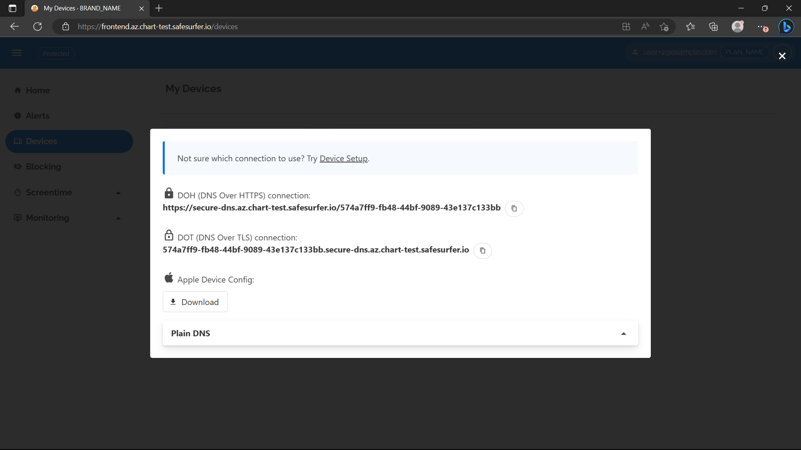

# DOH and DOT
DOH (DNS over HTTPS) or DOT (DNS over TLS) can be used to encrypt DNS requests to avoid privacy leaks over untrusted networks. In the case of Safe Surfer, DOH/DOT can be used to attribute requests to a source device more easily. This is done using the DNS token of the device. For DOH, the DNS token is specified in the path, e.g. `https://doh.ss.example.com/xxxxxxxx-xxxx-xxxx-xxxx-xxxxxxxxxxxx`. For DOT, the DNS token is specified in the subdomain, e.g. `xxxxxxxx-xxxx-xxxx-xxxx-xxxxxxxxxxxx.dot.ss.example.com`.

In this guide, we will assume you've set up the DNS either in kubernetes or on servers using the `ss-config` tool.

## Configuring DOH and DOT
All you have to do is set the following keys in your `values.yaml`, for either the Helm chart or `ss-config`:

```yaml
dns:
  doh:
    enabled: true
    # Tone down resources for testing
    replicas: 1
    host: doh.ss.example.com
  dot:
    enabled: true
    # Tone down resources for testing
    replicas: 1
    host: dot.ss.example.com
```

## TLS setup

Both `doh` and `dot` require `tls` to be configured, but the options here are different for Kubernetes or `ss-config`.

### Kubernetes TLS
To set up a certificate for doh/dot on kubernetes, see the [ingress and cert guide](./ingress-and-cert-setup.md). HTTP01 validation is not supported for these services because:
- They do not use an ingress.
- DOT requires a wildcard certificate covering its domain and any subdomains.

Therefore, a custom certificate or DNS01 hooked up using `tls.secretName` are the only options. Just keep in mind that DOT needs a wildcard certificate for its subdomain, e.g. `*.dot.ss.example.com`, whereas DOH hosted at `doh.ss.example.com` could happily use a certificate generated for `*.ss.example.com` like the example shows.

> **Warning**
> DOH and DOT will automatically re-rollout when the current cert *expires* according to the time of the cluster. To avoid downtime due to time synchronization issues, re-rollout manually a day or so after the certificate renews. You can do this by e.g. `kubectl rollout restart deployment safesurfer-doh` or `kubectl rollout restart deployment safesurfer-dns` if in sidecar mode.

### ss-config TLS
The `ss-config` values only support `custom` as a cert option, but they also support an additional parameter, `certSync`, which periodically retrieves the public key from a host to keep the certificate valid. For example:

```yaml
dns:
  doh:
    tls:
      custom:
        cert:
        key:
    # Comment out to disable cert sync
    certSync:
      # Hostname to grab the public SSL cert from
      endpoint:
      # In systemd calendar timer format
      schedule: '*-*-* 4:00:00'
  dot:
    tls:
      custom:
        cert:
        key:
    # Comment out to disable cert sync
    certSync:
      # Hostname to grab the public SSL cert from
      endpoint:
      # In systemd calendar timer format
      schedule: '*-*-* 4:00:00'
```

`certSync` will check the new certificate matches the private key and isn't expired before applying it and restarting doh/dot. For convenience, you can use the `serveCertOnly` option on `doh` or `dot` on kubernetes to host the certificate without actually hosting the DNS.

## Domain/port setup
You can get DOH/DOT going on the same IP address, on separate addresses, or even on the same IP address as plain DNS. When using `ss-config`, the method is fairly simple. The `bindPort` parameter should already start them on the correct addresses to share with each other and plain DNS. On Kubernetes, there are a few different options:

### Seperate addresses
The default kubernetes config will start DOH/DOT as seperate deployments on separate addresses.

### Shared address (excluding plain DNS)
To share an address between DOH/DOT, disable the deployment and enable sidecar mode like so:

```yaml
dns:
  dns:
    enabled: true
    hostNetwork: false
    service:
      tcp:
        # Enabling this will enable DOH/DOT services on the DNS LB
        enabled: true
        type: LoadBalancer
        port: 53
  doh:
    deployment: false
    sidecar: true
    host: secure-dns.ss.example.com # Use the same host
  dot:
    deployment: false
    sidecar: true
    host: secure-dns.ss.example.com # Use the same host
```

This may have lower latency than deployment mode, since the DOH/DOT containers are always on the same machine (and within the same local network) as the main DNS container. However, it will be slower to roll out and scale, since the DNS init container must run for each new pod created.

> **Note**
> In this mode, the the `replicas`, `deploymentStrategy`, `horizonalPodAutoscaler`, `podDisruptionBudget`, `service`, and `affinity` fields below have no effect. To make changes to these fields, you'll have to consider the DNS deployment as a whole using the `dns.dns` fields.

After deploying something like the above, remembering to set up certs, you should see a pod like this:

```
NAME                                              READY   STATUS        RESTARTS         AGE
safesurfer-dns-76fbd7cf8f-8ftqq                   5/5     Running       0                13s
```

And run `kubectl get service` to see your new service IP:

```
NAME                                       TYPE           CLUSTER-IP     EXTERNAL-IP     PORT(S)                                    AGE
safesurfer-dns-tcp                         LoadBalancer   10.0.93.39     xx.xx.xxx.xx    53:31978/TCP,443:30879/TCP,853:30384/TCP   24m
```

The service includes DOH, DOT, and plain DNS, but due to kubernetes limitations the DNS is TCP-only. To truly get plain DNS working alongside DOH and DOT, see the next section.

### Shared address (including plain DNS)
To get plain DNS going alongside DOH and DOT, we'll use the host networking mode introduced in the [getting started](./getting-started.md) guide. Overwrite the following keys in your `values.yaml`:

```yaml
dns:
  dns:
    enabled: true
    hostNetwork: true
    service:
      tcp:
        enabled: false
    sidecarContainers:
      healthCheck:
        bindPort: 53531
        httpSecret:
          enabled: true
          secret: generate-a-strong-secret
  doh:
    deployment: false
    sidecar: true
    host: secure-dns.ss.example.com # Use the same host
  dot:
    deployment: false
    sidecar: true
    host: secure-dns.ss.example.com # Use the same host
```

Then, update the load balancing rules pointing to your node pool as described in the [getting started](./getting-started.md) guide. DOH runs on port 8443 and has a HTTP health check on port 8888. Its frontend port should be `443`. DOT runs on port 8358 and has a HTTP health check on port 8889. Its frontend port should be `853`. Both HTTP health checks use the GET method and `/` as the path. Remember to allow ports `8443` and `8358` through the firewall.

## Testing DOH/DOT
Once you've set up DOH/DOT using any of the above methods, you're ready to test.

If you've set up the API and frontend as part of an earlier guide, you should be able to refresh the frontend to view URLs you can use to test secure DNS. Select `Connect` on a device on the Devices page and you should see something like the following:



You can test DOH by putting the URL into your browser settings under `Use secure DNS`. This is supported by Firefox, Edge, and Chrome. You can test DOT by using [Private DNS](https://support.google.com/android/answer/9654714?hl=en#zippy=%2Cprivate-dns) on Android or the [kdig](https://www.knot-dns.cz/docs/2.6/html/man_kdig.html) tool with the `+tls` option.

You can test DOH on Apple devices by configuring the `.mobileconfig` file download. Add something like the following to your `values.yaml`

```yaml
api:
  devices:
    appleMobileConfig:
      dohAddresses: xx.xx.xx.xx
      dohHost: secure-dns.ss.example.com
      description: Use DNS filtering and logging
      name: Secure DNS
      extraSettings:
        # Make browsers use it by default
        braveStable: true
        braveBeta: true
        braveNightly: true
        chrome: true
        edge: true
        vivaldi: true
        chromium: true
        firefox: true
        yandex: true
      identifiers:
        payload: com.example.profile
        dnsSettings: com.example.profile.dnsSettings
        braveStable: com.example.profile.bravestablesettings
        braveBeta: com.example.profile.bravebetasettings
        braveNightly: com.example.profile.bravenightlysettings
        chrome: com.example.profile.chromesettings
        edge: com.example.profile.edgesettings
        vivaldi: com.example.profile.vivaldisettings
        chromium: com.example.profile.chromiumsettings
        firefox: com.example.profile.firefoxsettings
        yandex: com.example.profile.yandexsettings
```

> **Warning**
> Be extremely careful to maintain control of the IP you specify under `dohAddresses`.

After re-deploying, you should now be able to use the Apple Mobileconfig download button on the frontend.
