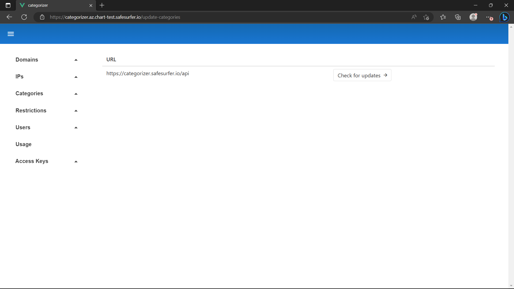

# Domain mirroring
Domain mirroring can be used to sync changes to domain categories from one categorizer instance to another. By hooking up domain mirroring from your instance to ours, you can avoid worrying about building your own domain database. Using the `Prevent Upstream Override` option on domains, you can maintain control over certain domains.

To test domain mirroring, you will need an API key to another categorizer instance. To get one to ours and use our domain database, contact us at [info@safesurfer.io](mailto:info@safesurfer.io).

To begin, access the admin app as described in the [getting started](./getting-started.md) guide. Then, navigate to the `Access Keys -> Remote Keys` page and hit `Add`. Then, enter the URL, username, and key for the categorizer instance to pull from.


Now, go to the `Categories -> Mirroring` page. You will see a couple of warnings about the cronjobs not being enabled, which we'll fix later. Hit the `Update Categories` button. You should now see a page listing the remote categorizers available:



Hit `Check for updates` and you should see a list of the remote categorizer's categories. Add any that you wish to use. You will want to avoid the `Always Allowed` category and add your own instead.


You will then want to repeat the process for restrictions by visiting the `Restrictions -> Mirroring` page.


If you already added a `Google` restriction as part of this guide, you'll want to add it manually instead of through the update menu:


If there are any domains that belong to a category with mirroring set up that you don't want to change, make sure to search for them now and tick the `Prevent Upstream Override` option.

Now let's open our `values.yaml` and enable any mirroring cronjobs we want to run. For example, to sync both domains and IPs, overwrite the following keys:

```yaml
categorizer:
  mirroring:
    enabled: true
  ipMirroring:
    enabled: true
    login:
      accessKey: generate-a-strong-password
```

Then upgrade the release. After visiting the `Categories -> Mirroring` page again, you should now see the option to `Run now`.


The first run can take 2-3 days to complete, but successive updates complete in minutes or seconds.
