# Getting Started
As part of the Getting Started guide, we'll set up a filtering DNS server that you can control from the admin app. We'll set up DNS servers on both kubernetes and individual servers. We won't add per-user or per-device filtering yet. This kind of setup can still be quite useful - for example, you could use it to block traffic across your whole network, or use DHCP to set up static filtering for a sub-set of users using Safe Surfer's central domain database. This guide is also a prerequisite for the next ones.

Although you can run Safe Surfer DNS on servers (VMs or bare metal), the other apps run inside Kubernetes.

So you'll need to have access to a kubernetes cluster before proceeding, for example:
- [EKS](https://aws.amazon.com/eks/) (AWS)
- [AKS](https://learn.microsoft.com/en-us/azure/aks/) (Microsoft Azure)
- [GKE](https://cloud.google.com/kubernetes-engine) (Google Cloud)
- [Kind](https://kind.sigs.k8s.io/) (Run locally, not for production)
- [Minikube](https://minikube.sigs.k8s.io/docs/start/) (Run locally, not for production)
- Any other Kubernetes distribution, e.g. openstack

If you'll be running DNS in the cluster, you should make a public cluster, not a private one. In a public cluster, each node has its own public IP address with which to access the internet directly. Without this, you'll be using NAT, which can be a performance bottleneck for DNS servers.

You will also need to install [Helm](https://helm.sh), the package manager for Kubernetes.

Once Helm is up and running, add the Safe Surfer repo:

```sh
helm repo add safesurfer https://safe-surfer.github.io/Core
```

Next, create a `values.yaml` file in the directory of your choosing. Add your image pull secret at the beginning of the file:

```yaml
imagePullSecret:
  username: username
  password: password
  email: test@example.com
```

You can contact us at [info@safesurfer.io](mailto:info@safesurfer.io) for a free pull key for demo purposes.

This will allow kubernetes to pull images from our container registry.

## Setting up a database
Safe Surfer needs a [postgresql](https://www.postgresql.org) database to store persistent data. The chart supports two different ways of connecting to one:

- Provide connection/login details to any existing postgres database. You can easily set one up on any major cloud provider. Versions 11+ are supported.
- Generate manifests for [postgres-operator](https://github.com/zalando/postgres-operator), which will create a new postgres database cluster for you. Safe Surfer then automatically connects to it. This is great for testing, since it works in kind/minikube, but also suitable for production. Be warned though, all data may be lost when you uninstall the chart, which is not true for the above option. This option also makes it more difficult to migrate to a different cluster without downtime.

### Existing database
To use an existing database, add the connection details to your `values.yaml`. You may want to create a new database and user for the Safe Surfer deployment.

```yaml
db:
  inCluster:
    enabled: false
  external:
    enabled: true
    pguser: safesurfer
    pgpassword: safesurfer
    pghost: 10.10.10.10
    pgdb: safesurfer
    pgsslmode: require
```

Now just deploy the chart - if everything is configured correctly, the new release will run migrations to create tables in the database:

```sh
helm install "safesurfer" "safesurfer/safesurfer" -f values.yaml
```

View the pods using `kubectl get pods` until it looks something like this:

```
NAME                                        READY   STATUS      RESTARTS   AGE
safesurfer-db-migrations-ncjofiwvgw-4hbnz   0/1     Completed   0          25s
```

#### Troubleshooting:
- If the migrations pod takes a long time or errors, you can see what's happening by running `kubectl logs $MIGRATIONS_POD` where `$MIGRATIONS_POD` is the name of the migrations pod above.
- If you get a log like `The current migration state is dirty: please fix manually then retry.`, then likely an earlier job will contain the actual error. Try to find the oldest migrations pod and view its logs instead.
- Migrations will fail if the database version isn't at least 11.

### In-cluster database
To use an in-cluster database (recommended if you're testing using kind/minikube), first install postgres operator. This example deploys it to the `postgres-operator` namespace.

```sh
kubectl create namespace "postgres-operator"
helm repo add "postgres-operator-charts" "https://opensource.zalando.com/postgres-operator/charts/postgres-operator"
helm -n postgres-operator install "postgres-operator" "postgres-operator-charts/postgres-operator"
```

Run `kubectl --namespace=postgres-operator get pods -l "app.kubernetes.io/name=postgres-operator"` until you see that postgres operator is running:

```sh
NAME                                 READY   STATUS    RESTARTS   AGE
postgres-operator-664dbb4997-v6gkm   1/1     Running   0          42s
```

Now add the following to your `values.yaml` to enable the in-cluster database:

```yaml
db:
  inCluster:
    ## Tone down the resources so this fits locally - readjust for production
    cpuRequest: "10m"
    memoryRequest: "256Mi"
    cpuLimit: "1"
    memoryLimit: "512Mi"
    volume:
      size: 4Gi
    connectionPooler:
      cpuRequest: 10m
      memoryRequest: 16Mi
      cpuLimit: 100m
      memoryLimit: 32Mi
```

Now just install the chart - if everything is configured correctly, a new database cluster will be created, a user/database created within, and finally a job will be created to bring up the database tables.

```sh
helm install "safesurfer" "safesurfer/safesurfer" -f values.yaml
```

View the pods using `kubectl get pods` until it looks something like this:

```
NAME                                        READY   STATUS      RESTARTS   AGE
safesurfer-db-0                             1/1     Running     0          2m43s
safesurfer-db-1                             1/1     Running     0          91s
safesurfer-db-migrations-tlfo7inizf-hjkz6   0/1     Completed   0          2m44s
safesurfer-db-pooler-59cc88bd45-shmkt       1/1     Running     0          37s
safesurfer-db-pooler-59cc88bd45-tsr82       1/1     Running     0          37s
```

Once the `migrations` pod has `Completed`, you're ready to start enabling other features of the Safe Surfer deployment.

#### Troubleshooting
- To create the database, the kubernetes nodes must download a few container images. If the connection speed is low, it may take too long to create the database, which will cause the migrations pod to fail. In this case, you can wait for the database to create successfully, then deploy again using `helm upgrade "safesurfer" "safesurfer/safesurfer" -f values.yaml`.
- If pods are stuck `Pending`, you may need to lower the resource requirements in your `values.yaml` further.

## Setting up the admin app
Now that we've got a database, the next thing we'll set up is the admin app. This is a GUI and API that we'll use to add some categories and domains. Add the following to your `values.yaml`:

```yaml
categorizer:
  adminApp:
    enabled: true
    admin:
      username: admin
      password: generate-a-strong-password
redis:
  enabled: true
```

Now upgrade the deployment:

```sh
helm upgrade "safesurfer" "safesurfer/safesurfer" -f values.yaml
```

View the pods using `kubectl get pods` until `admin-app` and `redis` are `Running`:

```
NAME                                        READY   STATUS      RESTARTS   AGE
safesurfer-admin-app-668964c99c-zknhn       1/1     Running     0          39s
safesurfer-db-migrations-3sjfh2r2xm-l72b9   0/1     Completed   0          39s
safesurfer-redis-0                          1/1     Running     0          39s
```

It's normal for the `migrations` job to run for every deployment. It will not do anything unless the current database migrations
are out of date.

To access the admin app, we have a few options:
- Create an ingress. This is not available when running locally.
- Use port-forwarding. Using this method means anyone wanting to access the admin app needs access to the k8s cluster, which may or may not suit your needs.

### Creating an ingress
Follow the [guide](./ingress-and-cert-setup.md) for setting up an ingress and certs. Then, add an ingress spec to `adminApp` in your `values.yaml` like so:

```yaml
categorizer:
  adminApp:
    # Uncomment below to restrict by source IP
    # authIpWhitelist:
    # - 0.0.0.0/32
    ingress:
      enabled: true
      host: categorizer.ss.example.com
      tls:
        # See the ingress and cert guide
```

Ensure that you've set up a strong password and that a DNS entry exists for the domain that you've chosen. Once the certificate and ingress are ready, access the admin app from the domain and enter the username/password.

### Using port-forwarding
In a separate terminal, run `kubectl port-forward svc/safesurfer-admin-app 8085:8080`. Then, you can access the admin app
from `http://localhost:8085` in your browser.

#### Troubleshooting
- Ensure port 8085 is free on your local machine. If not, choose a different port.
- If you have overridden `categorizer.adminApp.svcPort`, substitute that for `8080`.

## Using the admin app
The admin app can be used to manage domains, categories, restrictions, IP addresses, users, and anonymized usage data. You can use the GUI, or you can automate tasks using the [admin API](https://safesurfer.gitlab.io/admin-app-api-docs/). In this guide, we will use the GUI to:
- Enforce Safe Search on Google across the whole network
- Create a category containing domains that will be blocked for everyone
- Categorize some other (unblocked) sites.

To begin, we will add a few categories. Navigate to the `Categories -> Categories` page on the side menu. It should look something like this:

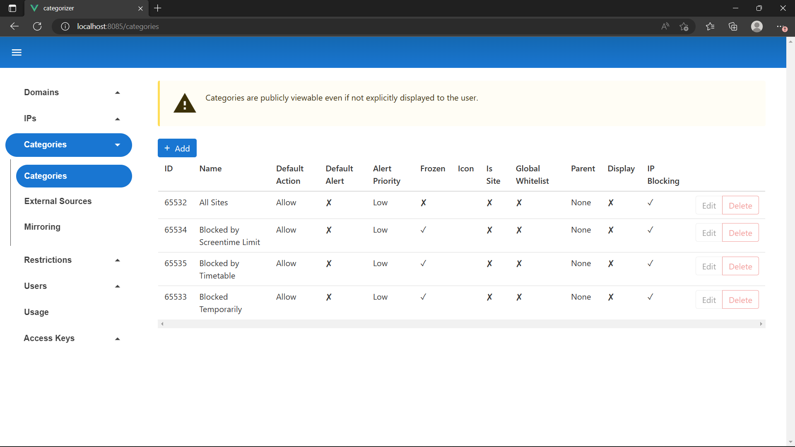

`Add` a new category. Enter the following details:

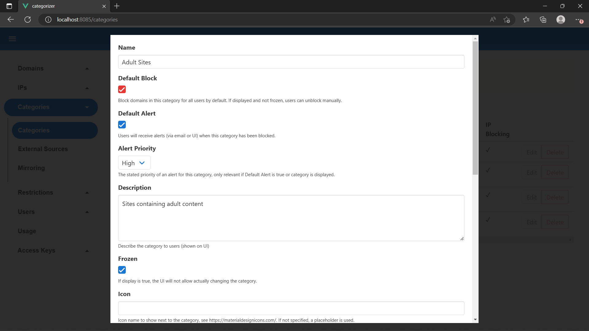
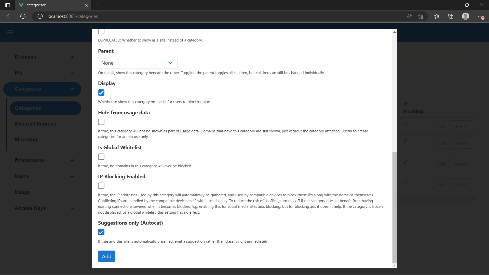

Select `Add`. Ensure you `Display` the category. Now add two more categories named `News` and `Search Engines`. You can leave all settings on their defaults for these, but `Display` them also. Your categories list should now look like this:

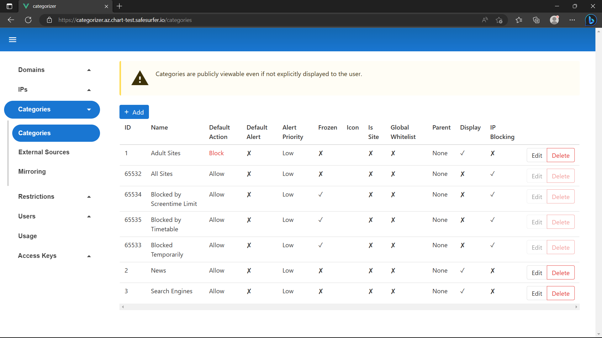

Now let's add some domains to the categories. Navigate to the `Domains -> Search` page and search for `exampleadultsite.com`.

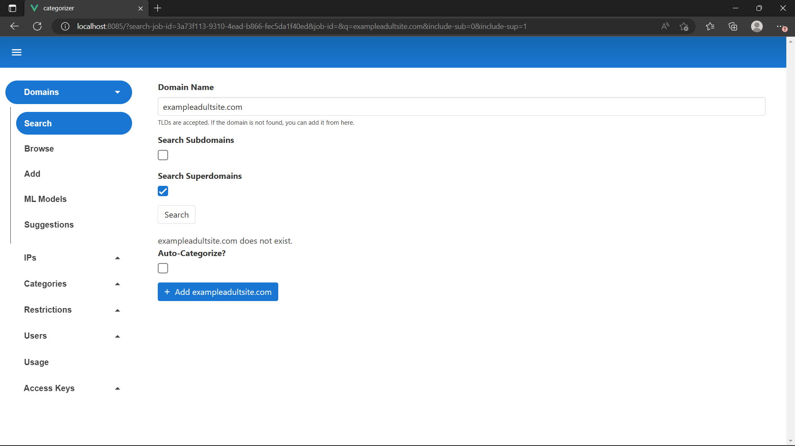

Leave `Auto-Categorize` unchecked since we haven't set that up yet. Select `Add exampleadultsite.com`. Then select the domain name to edit it. 

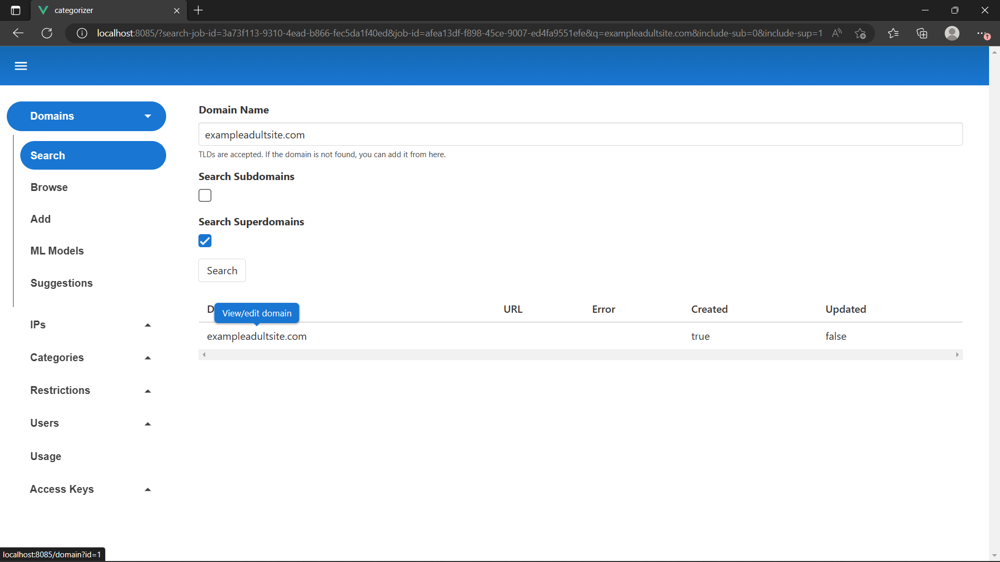
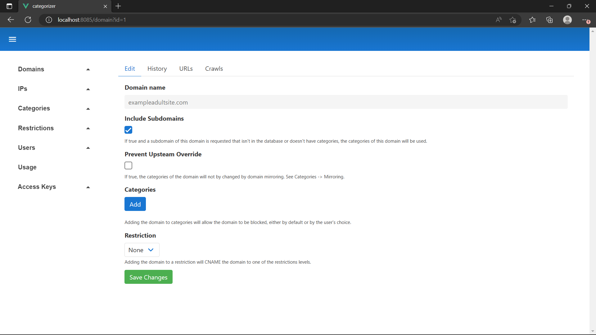

Now add the `Adult Sites` category to the domain and hit save.

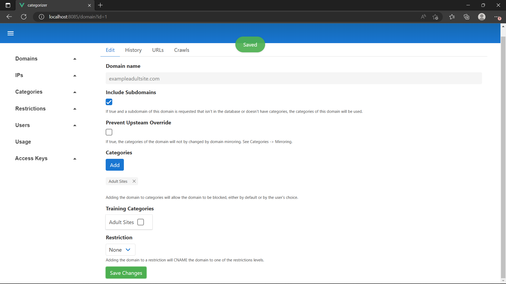

Repeat this process to add `nytimes.com` to the `News` category. Next, we will add a `Restriction` that enforces Safe Search on Google for everyone on the network. Navigate to the `Restrictions -> Restrictions` page and hit `Add`.

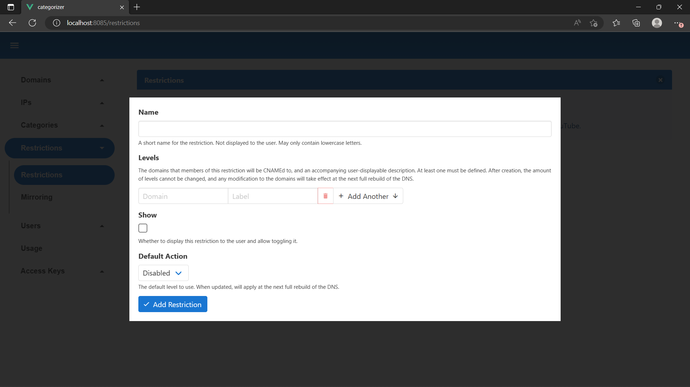

Enter the following details then hit `Add Restriction`. Note the cut off text under `Levels` is `forcesafesearch.google.com`.

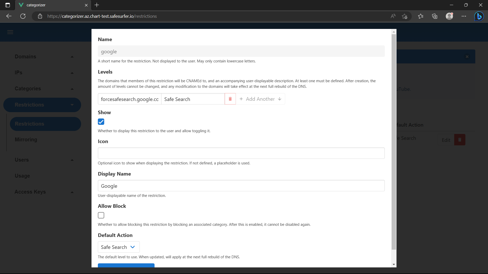

Now navigate to the `Domains -> Add` page. You can leave the settings at the top, but enter the following at the bottom:

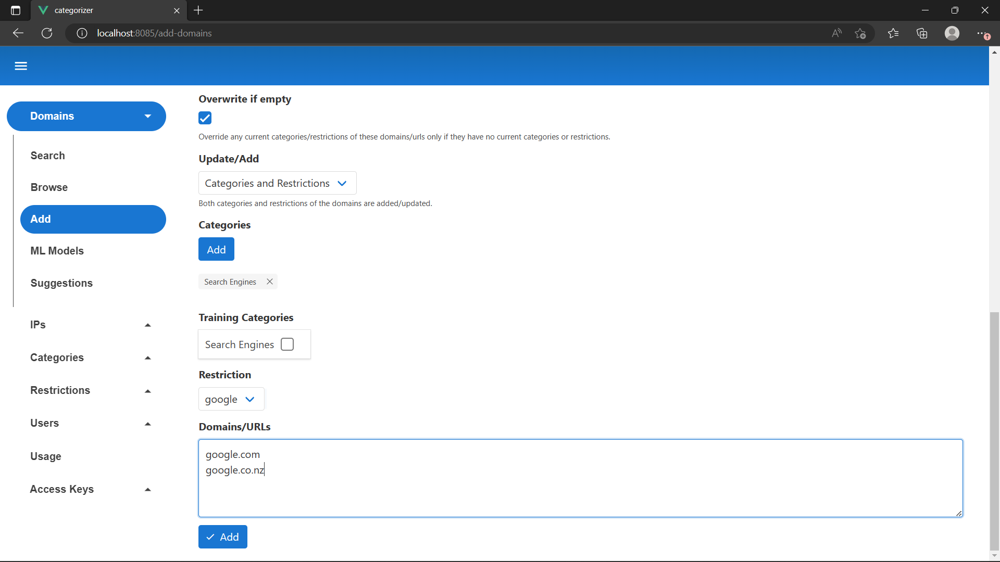

Now hit `Add`. You should see a result like the following:

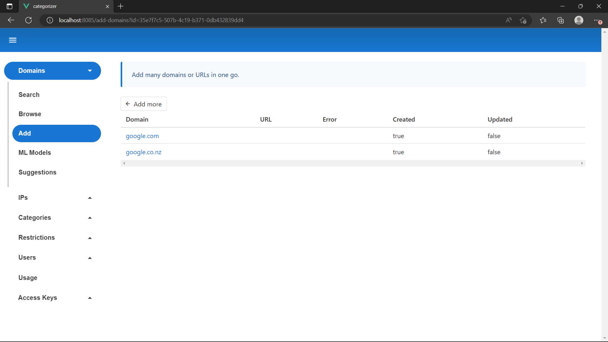

> **Note**
> This is not the full list of Google Search domains. To get the full list, try [enabling domain mirroring](./domain-mirroring.md) to sync from our database. This also includes domains for enforcing safe search on the other search engines and YouTube.

Now that we have some domains, we're ready to deploy the DNS and see what it does.

## Deploying the DNS
There are two ways of deploying the DNS: on kubernetes, and on individual servers using the `ss-config` tool. You can complete one or both of the sections below to get an idea.

### K8s DNS
Unfortunately, it isn't possible to create a load balancer with both UDP and TCP using the same IP on kubernetes. This means you can't host plain DNS on kubernetes using a simple service. However, it is possible to convert each kubernetes node into its own DNS server using host networking. Later on, you can host Plain DNS, DOH, and DOT on the same IP using this approach. Add the following to your `values.yaml`:

```yaml
dns:
  enabled: true
  dns:
    enabled: true
    hostNetwork: true
    replicas: 1
    debugging:
      accountQueryDomain: account.safesurfer
      protoQueryDomain: proto.safesurfer
      domainLookupDomain: domain.safesurfer
      explainDomain: explain.safesurfer
    # Tone resources down for testing
    resources:
      requests:
        memory: "128Mi"
        cpu: "100m"
    initContainers:
      iptablesProvisioner:
        enabled: true
    sidecarContainers:
      lmdbManager:
        # Tone resources down for testing
        resources:
          domains:
            requests:
              memory: "128Mi"
              cpu: "100m"
            limits:
              memory: "128Mi"
              cpu: "200m"
          accounts:
            requests:
              memory: "128Mi"
              cpu: "100m"
            limits:
              memory: "128Mi"
              cpu: "200m"
      healthCheck:
        bindPort: 53531
        httpSecret:
          enabled: true
          secret: generate-a-strong-secret
```

Then, upgrade the release:

```sh
helm upgrade "safesurfer" "safesurfer/safesurfer" -f values.yaml
```

After running `kubectl get pods` you should now see something like this:

```
NAME                                        READY   STATUS        RESTARTS      AGE
safesurfer-dns-57b77b9978-nff8p             4/4     Running       0             26s
```

If you were quick enough, you may have seen the `dns` pod `Initializing`. This process should have been quick because our database
is small, but it can take a few minutes once your database is loaded with domains and/or users. During the `Initializing` phase, the DNS loads its own local database, meaning your DNS speed and/or uptime isn't tied to your postgres database. It will live-update after this. The postgres database can even go down completely without impacting internet access. However, users or admins will not be able to change settings while there is database downtime.

Now that our DNS is running, we need to make it available to the internet. Since we're running host networking, we'll have to create a load balancer that points to the node pool of kubernetes itself. The way to do this depends on how you've deployed Safe Surfer.
- On Azure, the node pool is implemented as a VM scale set. Create a new public IP address in the infrastructure resource group for the k8s cluster. Keep in mind that deleting the cluster will delete this IP. Then add another health check to the existing kubernetes load balancer (see below) as well as two new load balancing rules. The load balancing rules should be `UDP/53 to UDP/53530` and `TCP/53 to TCP/53530` on the IP address you created. Then, on the VM scale set, allow inbound traffic to `53530` in the firewall rules.
- On GCP, you can create a new load balancer, there is no need to use the existing one. Reserve a new public IP and forward `UDP/53 to UDP/53530` and `TCP/53 to TCP/53530`. Select the kubernetes node pool as the backend. Allow inbound traffic to `53530` in the firewall rules. Create a new HTTP health check as shown below.
- When testing locally with minikube/kind, you can run the following command in a separate termainal to access the DNS: `kubectl port-forward svc/safesurfer-dns-internal 5353:53`. You can now query the DNS on `127.0.0.1:5353`.

#### Health Check
The health check ensures that DNS traffic is only directed to nodes that are actually running a healthy DNS pod. It should be a HTTP health check on port `53531` of the node pool with the path `/healthy?target=dns&secret=generate-a-strong-secret`. The secret should match what you specified in your `values.yaml`. You must be careful with the interval and timeout of your health check. When a DNS pod receives the signal to terminate (as may occur during a normal rollout), it will keep running for `dns.dns.terminationWaitPeriodSeconds` (`30` by default). During this period, any health checks will return a non-2xx status code to allow traffic to be directed away from the pod before it terminates. So you must ensure that your health check will fail within `terminationWaitPeriodSeconds`, even if the DNS pod starts terminating right after the most recent health check succeeds.

#### Other considerations for production
- Ensure that each node has its own public IP, otherwise you will be using NAT for outbound traffic, which is a performance bottleneck for DNS.
- Configure `dns.dns.hpa` and `dns.dns.pdb` for autoscaling according to your needs.
- If your cluster is also hosting other services, you may wish to make the DNS its own node pool using [node taints](https://kubernetes.io/docs/concepts/scheduling-eviction/taint-and-toleration/) and point the load balancer towards that. You can then use `dns.nodeSelector` and `dns.tolerations` to ensure that node pool only hosts the DNS. For example, if you made a node pool named `dns-1` with the taint `NoSchedule: ss-role=dns`, then you could use the following in your `values` to only schedule on that pool:
```yaml
dns:
  nodeSelector:
    # This differs based on platform.
    # Check your node labels to find a matching value, e.g.
    # kubectl get node my-dns-node -o=jsonpath='{.metadata.labels}' | jq
    cloud.google.com/gke-nodepool: dns-1
  # Allow the DNS to schedule on the tainted node pool
  tolerations:
  - key: ss-role
    operator: Equal
    value: dns
    effect: NoSchedule
```

### Server DNS
The DNS can run on any linux OS supporting systemd and docker. It only requires a database connection to the postgres database used by the rest of deployment. Internet access through the DNS does not depend on the postgres database being up - this only affects whether users or admins can change settings. The `ss-config` tool can template configuration files or a [cloud-init](https://cloud-init.io/) file to install Safe Surfer DNS on any operating system. It takes input in the same `values.yaml` format as the helm chart, but does not support all the parameters, for example autoscaling must be handled differently for server deployments.

> **Warning**
> `ss-config` assumes a fresh system - it makes several changes to your system configuration as necessary, such as disabling `systemd-resolved`, enabling other services, and overwriting docker config.

`ss-config` is distributed as a simple binary - you can download it for your system from the following links:
| System architecture      | Link |
| ----------- | ----------- |
| Windows amd64      | [link](https://files.safesurfer.io/files/dev/ss-config.1.0.0.windows-amd64.exe)       |
| Windows arm64   | [link](https://files.safesurfer.io/files/dev/ss-config.1.0.0.windows-arm64.exe)        |
| Windows 386   | [link](https://files.safesurfer.io/files/dev/ss-config.1.0.0.windows-386.exe)        |
| Linux arm64   | [link](https://files.safesurfer.io/files/dev/ss-config.1.0.0.linux-arm64)        |
| Linux amd64   | [link](https://files.safesurfer.io/files/dev/ss-config.1.0.0.linux-amd64)        |
| Linux 386   | [link](https://files.safesurfer.io/files/dev/ss-config.1.0.0.linux-386)        |
| Darwin (Mac) amd64   | [link](https://files.safesurfer.io/files/dev/ss-config.1.0.0.darwin-amd64)        |
| Darwin (Mac) arm64   | [link](https://files.safesurfer.io/files/dev/ss-config.1.0.0.darwin-arm64)        |

Rename the binary to `ss-config`, ensure it has execute permissions, and move it to your path. Alternatively you can use it directly from the download location.

Grab a copy of the default values for `ss-config` from `ss-config/values.yaml` in this repo, and name it `server-values.yaml` in your working directory. Note that `ss-config` doesn't *quite* work like `helm` - your `server-values.yaml` isn't overriding the defaults, but rather it *is* the values, which is why we're copying the whole file.

To start with, copy your existing image pull secret:
```yaml
imagePullSecret:
  username:
  password:
```

Then, add database connection details:
```yaml
db:
  external:
    pguser: safesurfer
    pgpassword: safesurfer
    pghost: 10.10.10.10
    pgdb: safesurfer
    pgsslmode: require
```

If you're connecting to an internal database from your kubernetes deployment, you can adapt the following snippet into your `values.yaml` to create a database load balancer restricted by source IP. Then you can use the newly created service IP to connect from your server.
```yaml
db:
  inCluster:
    extraSpec:
      enableMasterPoolerLoadBalancer : true
      # Uncomment allowedSourceRanges if your DNS servers won't share an internal network with the kubernetes cluster
      # hosting your internal database.
      # allowedSourceRanges:
      # # Change the below to the source IP of your server(s). Ensure they are in CIDR syntax.
      # - 10.10.10.10/32
      # Uncomment serviceAnnotations to create an internal load balancer to DNS servers to use.
      # serviceAnnotations:
      #   # Configure the below to create an internal load balancer for your platform
      #   networking.gke.io/load-balancer-type: "Internal"
      #   networking.gke.io/internal-load-balancer-allow-global-access: "true"
      #   service.beta.kubernetes.io/azure-load-balancer-internal: "true"
```

Then, configure the DNS:
```yaml
dns:
  dns:
    debugging:
      accountQueryDomain: account.safesurfer
      protoQueryDomain: proto.safesurfer
      domainLookupDomain: domain.safesurfer
      explainDomain: explain.safesurfer
    sidecarContainers:
      healthCheck:
        enabled: true
        httpSecret:
          enabled: true
          secret: generate-a-strong-secret
        useFallbackRoute: true
```

Now we can use the `ss-config` tool to generate the installation files. Just run `ss-config -f server-values.yaml`, which if successful shouldn't print anything to the console. There should now be a `vm-config` folder in your working directory. Inside the `vm-config` should be two items:
- A `cloud-init.yaml` file, which will automatically create the desired files when provided to any VM creation process that supports cloud-init.
- An `etc` folder, which can be copied to the root directory of the server manually.

After transferring the files to the server using either method, navigate to the `/etc/safesurfer` directory. You should see a set of files that look like this:

```
dns  init.sh  status
```

Ensure `init.sh` has execute permissions:

```sh
sudo chmod +x init.sh
```

Run `init.sh`:

```sh
sudo ./init.sh
```

The script should guide you through the installation process from here. As mentioned, when done, you can choose to make an image of the disk at this point or reboot to test now. After rebooting, the disk will no longer be suitable for creating an image, because it will contain data which may be out of date by the time you deploy the image.

Regardless of the option you choose, after booting (or rebooting) a DNS server, you can check its status by running `sudo docker ps`. You should see a result like the following:

```
CONTAINER ID   IMAGE                                                          COMMAND                  CREATED          STATUS          PORTS     NAMES
cb8d23f93746   registry.gitlab.com/safesurfer/core/apps/dns:1.15.4            "/app/run-server.sh"     35 seconds ago   Up 34 seconds             ss-dns
f2b303b922ac   registry.gitlab.com/safesurfer/core/apps/status:1.0.0          "/app/status-exec"       35 seconds ago   Up 35 seconds             ss-status
ebbd627e0a89   registry.gitlab.com/safesurfer/core/apps/lmdb-manager:1.15.5   "python3 /app/dump-a…"   36 seconds ago   Up 34 seconds             ss-lmdb-manager-accounts
afab8731cd59   registry.gitlab.com/safesurfer/core/apps/lmdb-manager:1.15.5   "python3 /app/dump-d…"   36 seconds ago   Up 34 seconds             ss-lmdb-manager-domains
```

If you were quick enough, you might have seen the init container running instead. This process should have been quick because our database is small, but it can take a few minutes once your database is loaded with domains and/or users. During the init phase, the DNS loads its own local database, meaning your DNS speed and/or uptime isn't tied to your postgres database. It will live-update after this. The postgres database can even go down completely without impacting internet access. However, users or admins will not be able to change settings while there is database downtime.

## Testing the DNS
Regardless of if you've set up the DNS on Kubernetes or Server(s), we can now query the DNS to see what it does. You can even switch your machine/network to your new DNS server to try it out.

Using the `dig` tool to query the DNS is recommended. It's present (or installable) on most linux distros, and if you're on Windows you can access it with WSL. Otherwise, you can use `nslookup`, but it doesn't give as detailed responses.

First, create a variable containing the IP address your DNS is available on:

```sh
DNS_IP="10.10.10.10"
```

The DNS should be enforcing Safe Search on Google according to our earlier settings:

```sh
dig @$DNS_IP google.com
```

```
; <<>> DiG 9.18.1-1ubuntu1.2-Ubuntu <<>> @10.10.10.10 google.com
; (1 server found)
;; global options: +cmd
;; Got answer:
;; ->>HEADER<<- opcode: QUERY, status: NOERROR, id: 46357
;; flags: qr rd ra; QUERY: 1, ANSWER: 2, AUTHORITY: 0, ADDITIONAL: 1

;; OPT PSEUDOSECTION:
; EDNS: version: 0, flags:; udp: 512
;; QUESTION SECTION:
;google.com.                    IN      A

;; ANSWER SECTION:
google.com.             0       IN      CNAME   forcesafesearch.google.com.
forcesafesearch.google.com. 2004 IN     A       216.239.38.120

;; Query time: 240 msec
;; SERVER: 10.10.10.10#53(10.10.10.10) (UDP)
;; WHEN: Tue Mar 14 15:27:51 NZDT 2023
;; MSG SIZE  rcvd: 85
```

It should allow accessing a non-blocked site normally (also test TCP with this command):

```sh
dig @$DNS_IP nytimes.com +tcp
```

```
; <<>> DiG 9.18.1-1ubuntu1.2-Ubuntu <<>> @10.10.10.10 nytimes.com +tcp
; (1 server found)
;; global options: +cmd
;; Got answer:
;; ->>HEADER<<- opcode: QUERY, status: NOERROR, id: 25835
;; flags: qr rd ra; QUERY: 1, ANSWER: 4, AUTHORITY: 0, ADDITIONAL: 1

;; OPT PSEUDOSECTION:
; EDNS: version: 0, flags:; udp: 512
;; QUESTION SECTION:
;nytimes.com.                   IN      A

;; ANSWER SECTION:
nytimes.com.            94      IN      A       151.101.129.164
nytimes.com.            94      IN      A       151.101.193.164
nytimes.com.            94      IN      A       151.101.1.164
nytimes.com.            94      IN      A       151.101.65.164

;; Query time: 250 msec
;; SERVER: 10.10.10.10#53(10.10.10.10) (TCP)
;; WHEN: Tue Mar 14 15:31:12 NZDT 2023
;; MSG SIZE  rcvd: 104
```

Now what happens when we request a blocked site?

```sh
dig @$DNS_IP exampleadultsite.com
```

```
; <<>> DiG 9.18.1-1ubuntu1.2-Ubuntu <<>> @10.10.10.10 exampleadultsite.com
; (1 server found)
;; global options: +cmd
;; connection timed out; no servers could be reached
```

DNS resolution fails because we haven't specified a domain to redirect to when a domain is blocked. This may be the behavior you want, but it isn't recommended as users can confuse this for internet connection issues rather than blocking.

We will update this in one of the next sections - [creating a block page](./block-page.md).

## Live Updates
Changes you make in the admin app will instantly sync to the DNS. You can play around more with the DNS at this point - adding new domains, categories, etc. and watch them update by requesting the DNS.

## Next Steps
You've successfully created a filtering DNS server that uses static lists added through the admin app.

Try one of the next guides:
- [Monitoring](./monitoring.md)
- [Block Page](./block-page.md)
- [Per-user and per-device filtering](./per-user-and-device-filtering.md)
