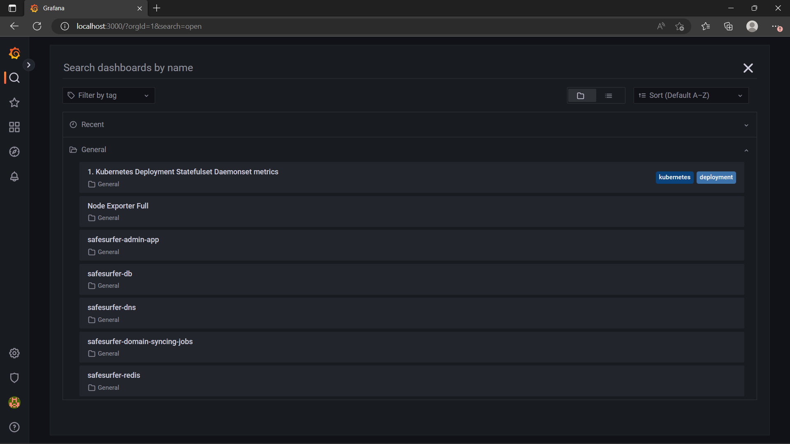
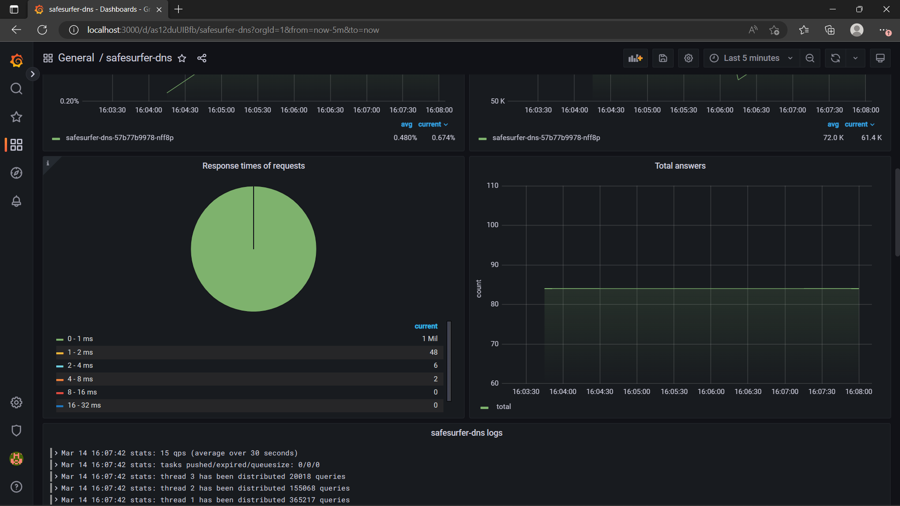

# Monitoring
This chart comes packaged with [Grafana](https://grafana.com/) dashboards that you can use to observe the deployments. Grafana pulls data from the [Prometheus](https://prometheus.io/) and [Loki](https://grafana.com/oss/loki/) databases. You can also set up alerts using Prometheus. As part of this guide, we'll install the above tools in the cluster and enable the Safe Surfer dashboards. You can complete this guide at any point during the other guides, or not at all.

## Installing the tools
See the [Monitoring Stack](https://gitlab.com/safesurfer/monitoring-stack) repo for how to install the tools. They may already be installed in your cluster, in which case you don't need to do anything.

## Enabling the dashboards
> **Warning**
> With this setup, the monitoring tools are installed into the `monitoring` directory. The dashboards will also be installed into the `monitoring` directory, not the `--namespace` that you provide to Helm. You can change this behavior by leaving `monitoring.namespace` blank and deploying grafana to your release's namespace.

Add the following to your `values.yaml`:

```yaml
monitoring:
  enabled: true
  namespace: monitoring
```

Then, upgrade your deployment:

```sh
helm upgrade "safesurfer" "safesurfer/safesurfer" -f values.yaml
```

Grafana should now be loaded with the dashboards. The instructions linked above show how to access grafana using port-forwarding, but you can also enable an ingress for convenience under `monitoring.ingress`. See [ingress and cert setup](./ingress-and-cert-setup.md) for more details.

After accessing Grafana through either method, you should now see a few useful dashboards in the `General` folder:



The `safesurfer-` dashboards monitor the Safe Surfer deployments specifically, while the others added by Grafana are useful for monitoring the cluster in general.

New dashboards are automatically added as you enable parts of the chart. For example, if you've enabled the DNS on kubernetes, the DNS dashboard will show some useful performance and resource usage information:



### Troubleshooting
- If you've deployed the monitoring stack to the monitoring namespace (as this example shows), the tls configuration may not work as you expect, since the ingress will also be created in the `monitoring` namespace. Therefore, you cannot reference a secret created in the release namespace.

## Alerting
You can use prometheus alerts to alert for any metrics in the cluster. A useful deployment for this is `healthChecks`, which generates prometheus metrics for uptime checks that you define. A Grafana dashboard also visualizes the status over time. To try it out, add the following to your `values.yaml`, updating the URLs/addresses to point to your own deployment:

```yaml
healthChecks:
  enabled: true
  spec:
    targets:
    # Comment out targets for anything you haven't created yet
    # HTTP health checks are useful for checking whether the API is running properly.
    - name: api
      interval: '*/10 * * * * *' # Every 10 seconds
      healthChecks:
      - type: HTTP
        spec:
          url: https://api.ss.example.com
          method: GET
          timeout: 5s
    # DNS health checks for whether the DNS is functioning properly.
    # Health checks for secure DNS are also available, see the full values.yaml
    # file for all examples.
    - name: plain-dns
      interval: '*/5 * * * * *' # Every 5 seconds
      healthChecks:
      - type: DNS
        spec:
          address: '0.0.0.0' # DNS resolver to query
          port: 53 # 53 is default
          proto: udp # udp is default
          domain: internetbadguys.com # domain to look up
          expectedIPs: # If specified, assert that certain IPs must be returned.
          - '0.0.0.0'
          timeout: 2s
      # Also test ipv6 - or comment out if you're not using ipv6
      - type: DNS
        spec:
          address: '[0::0]' # IPv6 must be in square brackets
          proto: tcp
          domain: google.com
          timeout: 5s
```

Then, upgrade the deployment. You should now see the health checks pod:

```
NAME                                             READY   STATUS      RESTARTS   AGE
safesurfer-health-checks-668c9fb88d-gkb9g        1/1     Running     0          116s
```

There should also be a new Grafana dashboard named `safesurfer-health-checks`, which shows whether your targets are currently healthy, how many successive failures they have, and the logs, which show why they fail. All going well, it should look something like this:


To actually get alerted, we'll need to update our prometheus deployment. Create a file named `prometheus-values.yaml`, and adapt the following snippet. Prometheus doesn't alert you on its own, but can be configured to work with a large number of alerting providers. The `receivers` array is where you define this. For the possible configurations, see the [prometheus docs](https://prometheus.io/docs/alerting/latest/configuration/#receiver).

```yaml
server:
  resources:
    limits:
      cpu: 500m
      memory: 1500Mi
    requests:
      cpu: 100m
      memory: 1500Mi
serverFiles:
  alerting_rules.yml:
    groups:
    - name: dns
      rules:
      # Alert for any target that is unhealthy 6 times in a row. This would equate to being down for a minute
      # if the health check runs every 10 seconds.
      - alert: TargetFrequentlyUnhealthy
        expr: ss_status_successive_errors > 5
        for: 0m
        labels:
          severity: critical
        annotations:
          summary: "Target {{ $labels.target }} unhealthy"
          description: "{{ $labels.target }} has been unhealthy for the last {{ $value }} checks"
      # Alert if the health check pod is down for more than a minute
      - alert: MonitoringProblem
        expr: absent(ss_status_is_error)
        for: 1m
        labels:
          severity: critical
        annotations:
          summary: "Health check not found"
          description: "No health check update for 1 minute"
alertmanager:
  config:
    route:
      receiver: safesurfer-team
      continue: false
      group_wait: 10s
      group_interval: 5m
      repeat_interval: 1h
    receivers:
    ## Define your receivers here:
    # - name: safesurfer-team
    #   opsgenie_configs:
    #   - api_key: example-api-key

```

Then upgrade your prometheus deployment. This depends on how you've deployed it, but according to the monitoring stack repo instructions it would be `helm -n monitoring upgrade prometheus prometheus-community/prometheus -f prometheus-values.yaml`.

To test our alerting system, we'll have to break something! Update your `values.yaml` to create a health check that won't succeed. For example, modify the URL/address; then upgrade the deployment. We should now see something like this on the Grafana health checks dashboard:


Your chosen alerting system should now be alerting you.

### Troubleshooting
- Not being alerted? Check prometheus server and alert manager logs for issues with prometheus configuration.

### Creating a status page
You can expose the current health status for your targets publicly over HTTP, which is useful for creating an automated status page. To do this, enable the `http` section and configure the ingress:

```yaml
healthChecks:
  http:
    enabled: true
    ingress:
      enabled: true
      host: status.ss.example.com
      tls:
        http01: true
        # Or other TLS config
```

After the certificate and ingress are ready, you can query the current status of particular targets:

```sh
$ curl https://status.ss.example.com/healthy?target=api
false
```

This API will return true or false for whether the target is currently healthy. If unhealthy, it will return a status code of `500`, allowing it to be used in place of services that expect to query a URL directly. If healthy, it will return a status code of `200`. In the above example, it's unhealthy, because we've deliberately made is so in the previous example. If we update our health check to succeed again, we'll get a response like this:

```sh
$ curl https://status.ss.example.com/healthy?target=api
true
```

## Common monitoring tasks
### API Abuse
Using the [Loki](https://grafana.com/oss/loki/) API, you can check if a particular IP addresses are spamming a particular API endpoint, or the API in general. This may be accidental, or deliberate abuse such as a DDOS attempt or password cracking. 

> **Note**
> The API includes built-in protection against password cracking if you set up `api.accounts.forceEmailOtpOnUnknownIpField`, since the auth endpoint will always return a 200 status code and an email OTP ID when the request is from an unknown IP address, city, or region.

To start off, set some variables:

```sh
# The route of the API endpoint you want to query, or blank for all
ROUTE="/v2/user/auth/token"
# The namespace of your deployment
NAMESPACE="default"
# The name of your helm release
RELEASE_NAME="safesurfer"
# Unix timestamp of the earliest time you want to query. You will have to generate this.
START_TIME=""
# Max amount of logs to return. 5000 is the maximum you can query from loki by default.
LIMIT="5000"
```

Then, port-forward loki in a separate terminal. The command for the default installation would look like this:

```sh
$ kubectl -n monitoring port-forward svc/loki 3100:3100
```
```
Forwarding from 127.0.0.1:3100 -> 3100
Forwarding from [::1]:3100 -> 3100
```

Then, run the query and save it to a temporary file:

```sh
QUERY_PARAM=$(printf "{app=\"${RELEASE_NAME}-api\", namespace=\"${NAMESPACE}\"} |= \"${ROUTE}\"" | jq -sRr @uri)
curl "http://localhost:3100/loki/api/v1/query_range?start=$START_TIME&limit=$LIMIT&query=$QUERY_PARAM" > /tmp/ss-query.json
```

Then, generate a histogram of the results:

```sh
cat /tmp/ss-query.json | jq '.data.result[].values[][1]' | rev | cut -d ' ' -f1 | rev | sed 's/[\\"]//g' | sort | uniq -c
```

The result will look something like this, where the number on the left is the amount of times the IP address requested that API endpoint:

```
      1 xx.xxx.xxx.xxx
     15 xx.xxx.xxx.xxx
```
