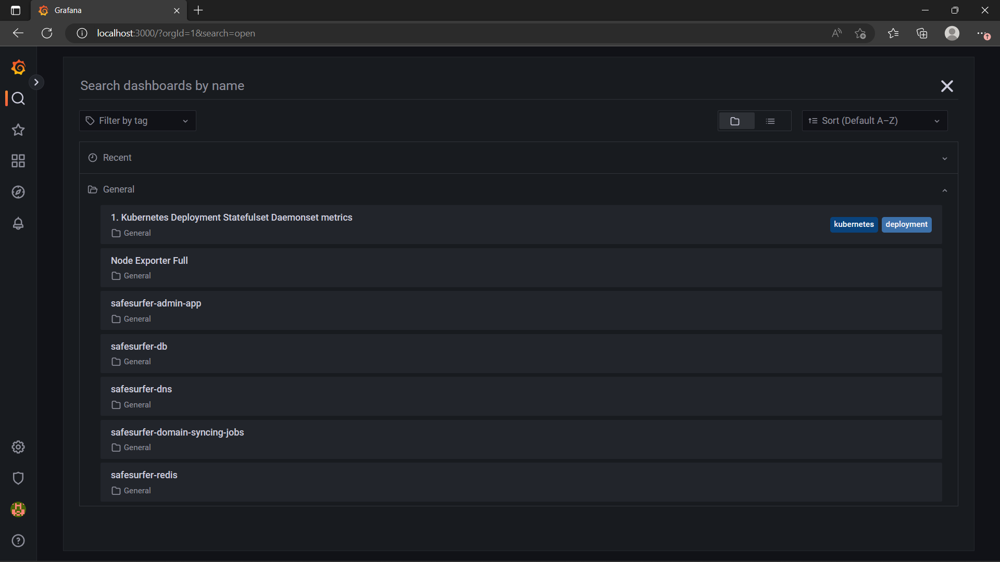
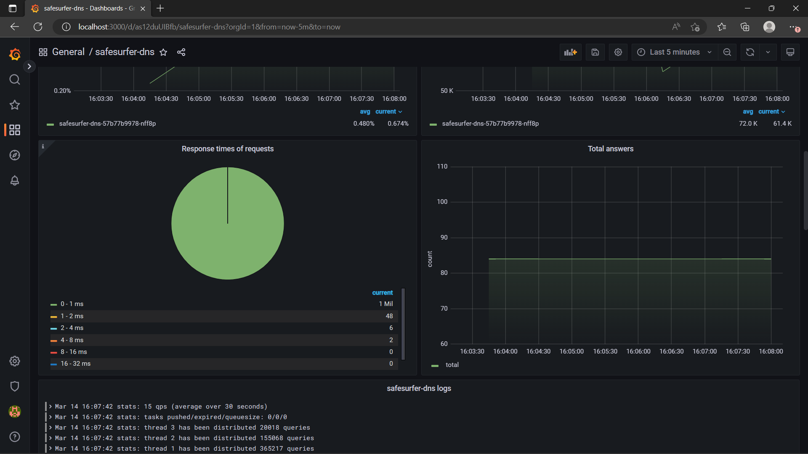

# Monitoring
This chart comes packaged with [Grafana](https://grafana.com/) dashboards that you can use to observe the deployments. Grafana pulls data from the [Prometheus](https://prometheus.io/) and [Loki](https://grafana.com/oss/loki/) databases. You can also set up alerts using Prometheus. As part of this guide, we'll install the above tools in the cluster and enable the Safe Surfer dashboards. You can complete this guide at any point during the other guides, or not at all.

## Installing the tools
See the [Monitoring Stack](https://gitlab.com/safesurfer/monitoring-stack) repo for how to install the tools. They may already be installed in your cluster, in which case you don't need to do anything.

## Enabling the dashboards
> **Warning**
> With this setup, the monitoring tools are installed into the `monitoring` directory. The dashboards will also be installed into the `monitoring` directory, not the `--namespace` that you provide to Helm. You can change this behavior by leaving `monitoring.namespace` blank and deploying grafana to your release's namespace.

Add the following to your `values.yaml`:

```yaml
monitoring:
  enabled: true
  namespace: monitoring
```

Then, upgrade your deployment:

```sh
helm upgrade "safesurfer" "safesurfer/safesurfer" -f values.yaml
```

Grafana should now be loaded with the dashboards. The instructions linked above show how to access grafana using port-forwarding, but you can also enable an ingress for convenience under `monitoring.ingress`. See [ingress and cert setup](./ingress-and-cert-setup.md) for more details.

After accessing Grafana through either method, you should now see a few useful dashboards in the `General` folder:



The `safesurfer-` dashboards monitor the Safe Surfer deployments specifically, while the others added by Grafana are useful for monitoring the cluster in general.

New dashboards are automatically added as you enable parts of the chart. For example, if you've enabled the DNS on kubernetes, the DNS dashboard will show some useful performance and resource usage information:


