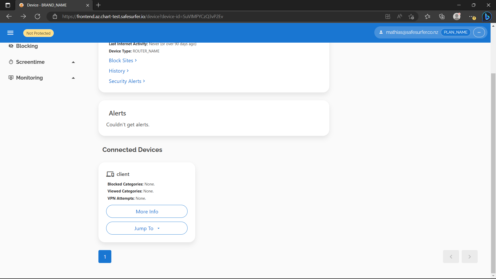
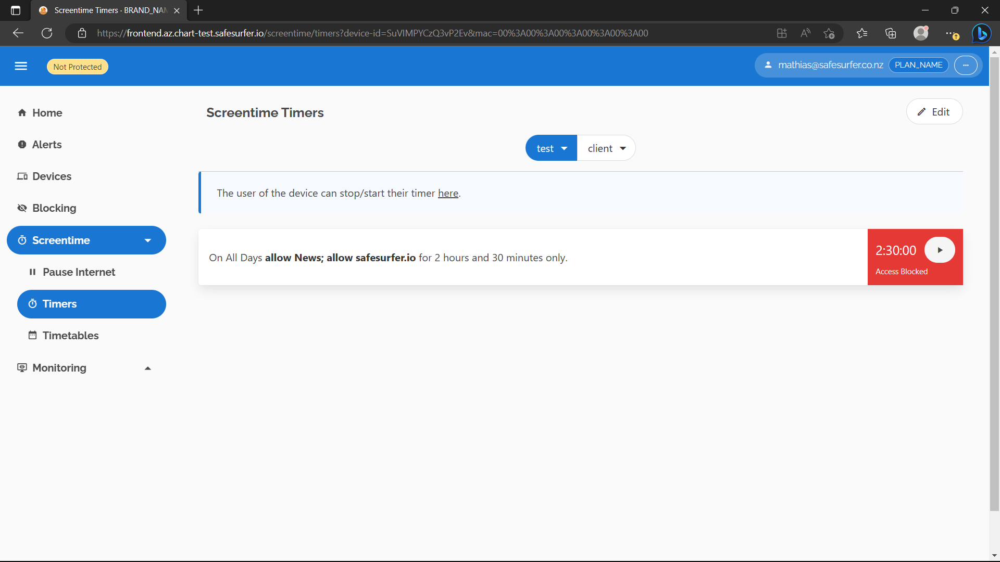
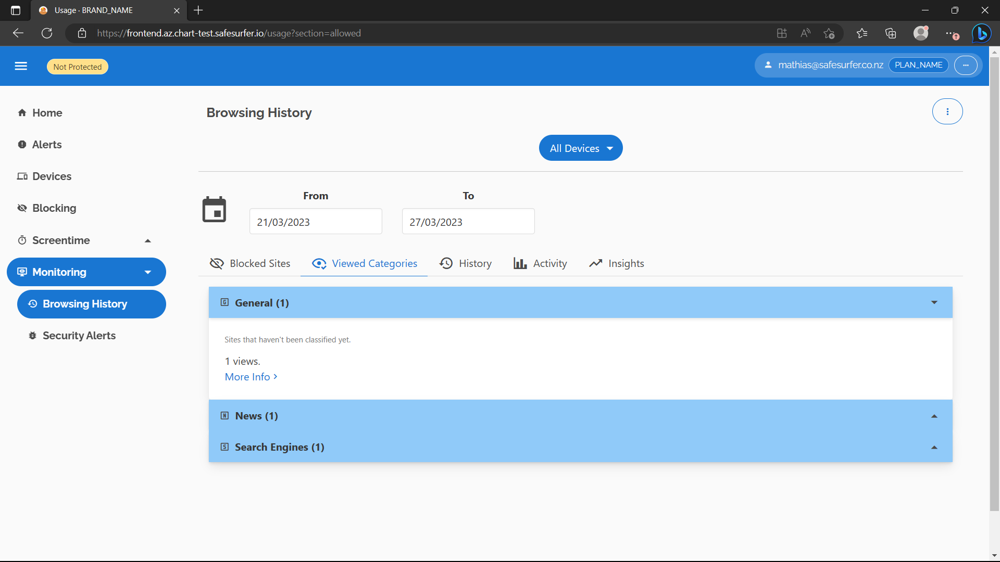
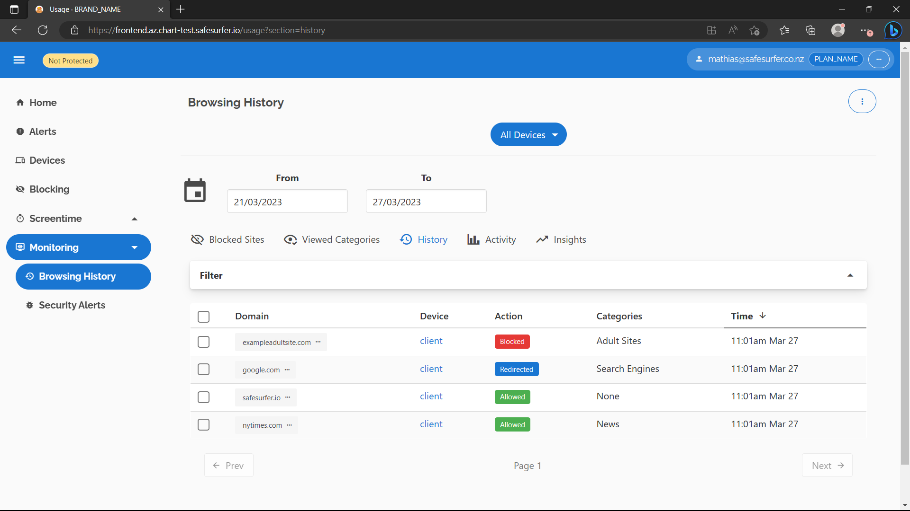

# Per-user and device filtering
Although you can get a lot of value out of the Safe Surfer deployment with just static lists, per-user and device filtering takes things to the next level. It gives you the following features:
- Per-user settings that apply to each home/business network.
- Per-device settings for *each client/internal device on a home/business network*.
- Screentime timers, timetables, and overrides.
- DNS request logging to provide browsing history, with automated email alerts for blocked content and insights.
- Security alerts with the [alphasoc](https://alphasoc.com) integration.

Per-network settings can be achieved using IP linking or DNS-over-HTTPS/DNS-over-TLS where available.
Router client-level settings can be achieved using our router integration for [OpenWRT](https://openwrt.org/).
Per-device settings can also be achieved by adding a unique DOH/DOT link for each device.

We'll explore all the things you can achieve in this guide. We'll assume that you've completed [getting started](./getting-started.md) first.

## Enabling the User API
The User API handles all per-user functions. For now, we're going to set accounts to "managed", which means users cannot be created, deleted, or sign in using the User API itself. Users can only access the API through codes that you generate through the Admin API. To achieve this, add the following to your `values.yaml`:

```yaml
# Enable the API
api:
  enabled: true
  replicas: 1
  # Admin auth on the API allows you to call API endpoints on behalf of users by providing it as a secret.
  # It runs on an entirely separate port, which by default, is only exposed within the cluster.
  adminSecret: generate-a-strong-secret
  # Tone this down for testing
  resources:
    requests:
      cpu: "10m"
      memory: "32Mi"
    limits:
      cpu: "50m"
      memory: "32Mi"
  # Managed accounts
  accounts:
    managed: true
  # Allow IP linking for now
  ipLinking:
    enabled: true
# Enable frontend so we can play with the API easily
frontend:
  enabled: true
  replicas: 1
```

Now wait for the API and frontend to come up by refreshing `kubectl get pods`. Once they're ready, it should look something like this:

```
NAME                                        READY   STATUS      RESTARTS   AGE
safesurfer-api-6f5f9c76f8-nqf77             1/1     Running     0          88s
safesurfer-frontend-7dfcd5dc76-tgzgm        1/1     Running     0          85s
```

To create a user, we'll need access to both the admin app and API. Access the admin app as described in the getting started guide. To access the API, we have a couple choices:

### Port-forwarding

To test IP linking later, overwrite the following keys in your `values.yaml`:

```yaml
api:
  # Use the source address directly
  realIPHeader: ''
```

In a separate terminal:

```
kubectl port-forward svc/safesurfer-api 8086:80
```

In your main terminal:

```sh
SS_API_ADDR="http://localhost:8086"
```

### Create an ingress
Set up an ingress as described in the [ingress and certs guide](./ingress-and-cert-setup.md) using the `api.ingress` field, e.g. something like this:

```yaml
api:
  ingress:
    enabled: true
    host: api.ss.example.com
    tls:
      http01: true
```

Then your API would be accessible on:

```sh
SS_API_ADDR="https://api.ss.example.com"
```

### Creating a user
When using managed accounts, user creation would usually be automated, so we'll use the APIs for this example. You can also create and delete users from the GUI.

Accessing the admin app as you did earlier, run the following request to create a user:
```sh
curl $CATEGORIZER_BASE_URL/api/users -d "email=$EMAIL&password=" --user $ADMIN_USER:$ADMIN_PASSWORD
```

- `CATEGORIZER_BASE_URL` should be the base URL for your admin app, e.g. `http://localhost:8085` or `https://categorizer.ss.example.com`.
- `EMAIL` should ideally be your own email so we can test the API's emails later.
- `ADMIN_USER` should be the value of `categorizer.adminApp.admin.username`.
- `ADMIN_PASSWORD` should be the value of `categorizer.adminApp.admin.password`.

If all is correct, you should get a result like the following:

```json
{"meta":{"timestamp":1679279050,"code":201,"errorCode":"","message":"OK"},"spec":{"id":"1","createdEmail":"user@example.com"}}
```

This tells us that our user's new `id` is `1`.

Now, we can generate an signin token for the user. We will also grant them a courtesy subscription so we can access all the dashboard functions.

```sh
curl $CATEGORIZER_BASE_URL/api/users/$USER_ID/subscription/courtesy -X POST --user ${ADMIN_USER}:${ADMIN_PASSWORD}
curl $CATEGORIZER_BASE_URL/api/users/$USER_ID/signin-tokens -d "expiry=$EXPIRY_TIME" --user ${ADMIN_USER}:${ADMIN_PASSWORD}
```

You should set `USER_ID` to the ID of your new user, e.g. `1`. You should set `EXPIRY_TIME` to a unix timestamp of when the signin token will expire. Note that the signin token is exchanged for an API auth token, so this is not the amount of time the user's auth token will be valid for. That is decided by `api.accounts.standardTokenExpiryTime`. You can set this to some time in the future by generating a unix timestamp using your favorite method, e.g. [this website](https://www.unixtimestamp.com/). Since we're testing, use a long interval.

If all is correct, you should get a result like the following:

```json
{"meta":{"timestamp":1679279566,"code":201,"errorCode":"","message":"OK"},"spec":"my-code"}
```

Now `my-code` can be used to obtain an auth token for user `1`. To test this, we'll need to access the frontend:

### Accessing the frontend
The frontend needs access to the API to work. Therefore, if you're using port-forwarding to access the API, you'll need to use it to access the frontend as well, because HTTPS sites are not allowed to connect to localhost addresses. Your source IP address must also match what the DNS sees for IP linking to work. This means that if you're accessing the DNS by port forwarding, then you must also access the frontend and API by port-forwarding.

#### Port-forwarding
Overwrite the following keys in your `values.yaml` to allow this to work over localhost:

```yaml
api:
  cors:
    extraOrigins: http://localhost:8087

frontend:
  apiHostOverride: http://localhost:8086
  adminAppHostOverride: http://localhost:8085
  extraScriptSrc: "https://js.chargebee.com http://localhost:8087"
```

Then in another terminal, port-forward the frontend:

```sh
kubectl port-forward svc/safesurfer-frontend-service 8087:8080
```

Now you should be able to access the frontend on `http://localhost:8087` in your browser.

#### Create an ingress
Or, set up an ingress as described in the [ingress and certs guide](./ingress-and-cert-setup.md) using the `frontend.ingress` field, e.g. something like this:

```yaml
frontend:
  ingress:
    enabled: true
    host: frontend.ss.example.com
    tls:
      http01: true
```

Then your API would be accessible on:

```sh
SS_FRONTEND_ADDR="https://frontend.ss.example.com"
```

Using either method, your frontend should look something like this:


In the URL bar, add the following to the end of the url:

```
&signin-token=my-code
```

Where `my-code` is the signin token you received from the admin app earlier. Then press enter. Soon enough, the dashboard should look like this:


The main page will not load because we haven't enabled browsing history yet, which is shown on the main page by default. We'll fix that later in the guide.

#### Troubleshooting
- If there is an error like `Failed to load resource: net::ERR_CONNECTION_REFUSED` in the browser console, make sure you're still port-forwarding the API if that was how you were accessing it.

## Device linking
There are two different methods of specifying a custom user and/or device to the DNS:
- IP linking. Using either a manual API call or an automation (such as a RADIUS integration), a source IP address can be associated with a user or device.
- A DNS token and/or MAC address can be provided to the DNS as [EDNS options](https://en.wikipedia.org/wiki/Extension_Mechanisms_for_DNS). When using DOH or DOT, the path or subdomain respectively form the DNS token, which is forwarded to the DNS. For plain DNS, the provisioned iptables rules protect against amplification attacks. The MAC address may be used on its own, or in combination with the DNS token to identify a client device on the user's network.

### IP Linking
To set up IP linking, let's check that the API is recognizing our source IP correctly. Navigate to the `Devices -> New Device -> Advanced` section of the dashboard.


Check "Link my IP to this device" and hit "Accept". On the next page, hit "Done". You should see something like the following:


Then hit "Connect" and expand the "Plain DNS" section. If you're port-forwarding, you should see the IP `127.0.0.1`, or if using an ingress, it should be your IP address. If you're using an ingress and don't see an IP matching your IP address, you'll need to modify the value of `api.realIPHeader`. Once the IP address looks correct, hit the button to link it.


After creating the device, we're also ready to use the DNS token method. Now let's set up some custom settings so we can test it.

## Custom settings and screentime

On the device you created, hit "Block Sites". You should see something like the following if you set up categories in the getting started guide:


You can do whatever you like here, as long as it's different to before and you hit save. For example, block the News category and set filtering on Google to "No Filtering".

Now let's query the DNS according to how you had it set up in the getting started guide.

To test IP linking, all you should have to do is make the query, assuming you still have the same source IP address as before.

You could check your new settings like so:

```sh
dig @$DNS_IP account.safesurfer TXT
# OR
nslookup -type=TXT account.safesurfer $DNS_IP
```

You should see a result like this (example for `dig`), identifying your account and device:

```

; <<>> DiG 9.18.1-1ubuntu1.2-Ubuntu <<>> @xx.xx.xx.xx account.safesurfer TXT
; (1 server found)
;; global options: +cmd
;; Got answer:
;; ->>HEADER<<- opcode: QUERY, status: NOERROR, id: 33713
;; flags: qr rd ra; QUERY: 1, ANSWER: 3, AUTHORITY: 0, ADDITIONAL: 1

;; OPT PSEUDOSECTION:
; EDNS: version: 0, flags:; udp: 512
;; QUESTION SECTION:
;account.safesurfer.            IN      TXT

;; ANSWER SECTION:
account.safesurfer.     3600    IN      TXT     "Device ID: \"vb28EefpHNdnZ6Om\""
account.safesurfer.     3600    IN      TXT     "Account ID: \"1\""
account.safesurfer.     3600    IN      TXT     "Lookup table: ip"

;; Query time: 239 msec
;; SERVER: xx.xx.xx.xx#53(xx.xx.xx.xx) (UDP)
;; WHEN: Tue Mar 21 11:49:09 NZDT 2023
;; MSG SIZE  rcvd: 146
```

If you see an account ID of `0` and no `Device ID` or `Lookup table` information, check that the DNS and the API are seeing the same source IP.

You can also test your rules now, e.g. if you blocked `News` and un-restricted `Google`, you'd see something like this:

```sh
$ dig +short @$DNS_IP nytimes.com
block.ss.example.com.
xx.xxx.xxx.xx
$ dig +short @$DNS_IP google.com
172.253.62.100
172.253.62.113
172.253.62.138
172.253.62.102
172.253.62.139
172.253.62.101
```

IP linking is great because it works regardless of the hardware being used, but depending on your network's setup, some users may have the same IP, or not sync their own IPs resulting in them receiving the custom rules and/or browsing history of a different account. Therefore, in most cases, you should not allow users to link their own IP, but instead use admin auth to set a user's linked IP according to RADIUS feed data or similar.

### Linking IP using admin auth
Port forward the admin service in a separate terminal:

```sh
kubectl port-forward svc/safesurfer-api-admin-internal 8088:80
```

Modify the IP for the device you created. You'll need to find the device ID for this, you can find it in the URL on the device page, e.g. `device-id=vb28EefpHNdnZ6Om`. Now make a request with admin auth:

```sh
curl http://localhost:8088/device/device/$DEVICE_ID/ip -d "ip=$IP" -H "X-Safe-Surfer-Api-Admin-Mock-User: $USER_ID" -H "X-Safe-Surfer-Api-Admin-Secret: $ADMIN_SECRET"
```

Where:

- `DEVICE_ID` is the ID of the device you've created.
- `IP` is the IP to link to it.
- `USER_ID` is the ID of the user you created.
- `ADMIN_SECRET` is the value of `api.adminSecret` in your `values.yaml`.

You can also enable `api.adminIngress` to allow using admin auth from outside the cluster. Of course, given the power admin auth gives you, you should secure it well.

### Using DNS tokens

Now let's test the other way of associating queries with a device. Each device has a DNS token which can be provided to the DNS using EDNS option 65002. Find your device's DNS token by hitting "Connect". There should be a DOH/DOT link shown for the device.


They will be incomplete because we haven't set up DOH/DOT yet, but the UUID you see there is the DNS token. By removing the dashes, you can supply it to the `dig` command like so:

```sh
dig @$DNS_IP +ednsopt=65002:f78665c852af42b687efd0a0333916f4 account.safesurfer TXT
```

Substitute `f78665c852af42b687efd0a0333916f4` for your own UUID. You should see a result like this:

```

; <<>> DiG 9.18.1-1ubuntu1.2-Ubuntu <<>> @xx.xx.xx.xx +ednsopt account.safesurfer TXT
; (1 server found)
;; global options: +cmd
;; Got answer:
;; ->>HEADER<<- opcode: QUERY, status: NOERROR, id: 8932
;; flags: qr rd ra; QUERY: 1, ANSWER: 3, AUTHORITY: 0, ADDITIONAL: 1

;; OPT PSEUDOSECTION:
; EDNS: version: 0, flags:; udp: 512
;; QUESTION SECTION:
;account.safesurfer.            IN      TXT

;; ANSWER SECTION:
account.safesurfer.     3600    IN      TXT     "Device ID: \"vb28EefpHNdnZ6Om\""
account.safesurfer.     3600    IN      TXT     "Lookup table: uuid"
account.safesurfer.     3600    IN      TXT     "Account ID: \"1\""

;; Query time: 240 msec
;; SERVER: xx.xx.xx.xx#53(xx.xx.xx.xx) (UDP)
;; WHEN: Tue Mar 21 12:58:40 NZDT 2023
;; MSG SIZE  rcvd: 148

```

The result should be the same as before, but now with `uuid` as the `Lookup table`. In general, a DNS token is a better method of identifying a device, and should be used instead of IP linking where possible.

### Using a MAC address
The Safe Surfer router integration syncs devices on the user's local network with the Safe Surfer API, and uses a combination of a DNS token + MAC address to identify each device. Since there are many possible setups, the router integration isn't publicly available, rather we can configure it according to your needs. For this demo, we'll use the API and dashboard to show what's possible.

To begin, obtain another auth token for your user:

```sh
AUTH_TOKEN=$(curl "$SS_API_ADDR/v2/user/auth/token/from-signin-token?signin-token=$(curl $CATEGORIZER_BASE_URL/api/users/$USER_ID/signin-tokens -d "expiry=$EXPIRY_TIME" --user ${ADMIN_USER}:${ADMIN_PASSWORD} | jq -r '.spec')" | jq -r '.spec.token')
```

Create a router device and get its DNS token:

```sh
DEVICE_ID=$(curl "$SS_API_ADDR/devices" -d 'type=lifeguard&name=test' -H "Authorization: Bearer $AUTH_TOKEN" | jq -r '.')
DNS_TOKEN=$(curl "$SS_API_ADDR/devices/device/$DEVICE_ID/dns-token" -H "Authorization: Bearer $AUTH_TOKEN" | jq -r '.')
```

> **Note**
> `lifeguard` is the name of our own router implementation. It persists in some parts of the API, but nothing user-facing.

Get an auth token for the router:

```sh
ROUTER_AUTH_TOKEN=$(curl "$SS_API_ADDR/v2/user/auth/token/from-signin-token?device-id=${DEVICE_ID}&signin-token=$(curl $CATEGORIZER_BASE_URL/api/users/$USER_ID/signin-tokens -d "expiry=$EXPIRY_TIME&role=router" --user ${ADMIN_USER}:${ADMIN_PASSWORD} | jq -r '.spec')" | jq -r '.spec.token')
```

> **Note**
> The auth token is restricted using the built-in `router` role, meaning it can only access API endpoints that it needs to as a router. This also cryptographically verifies the device ID for certain endpoints, meaning the auth token can only perform actions related to itself. Usually, the router gets an auth token through the remote-auth flow, which is accomplished automatically by the frontend & router frontend. This flow avoids sending user login details to the router directly, since this connection is often insecure. This flow works with managed accounts too, we're just using signin tokens here because it's simpler.

Add a client device:
```sh
$ curl "$SS_API_ADDR/devices/device/lifeguard/client" -X PUT -d 'name=client&mac=00:00:00:00:00:00' -H "Authorization: Bearer $ROUTER_AUTH_TOKEN" -i

```
```
HTTP/1.1 201 Created
Date: Thu, 23 Mar 2023 03:41:11 GMT
Content-Type: application/json
Content-Length: 4
Connection: keep-alive
Vary: Origin
Strict-Transport-Security: max-age=15724800; includeSubDomains

null
```

Set the current firmware version:
```sh
$ curl "$SS_API_ADDR/v2/devices/version" -X PUT -d 'version=4.0.0' -H "Authorization: Bearer $ROUTER_AUTH_TOKEN" -i
```
```
HTTP/1.1 201 Created
Date: Fri, 24 Mar 2023 02:50:58 GMT
Content-Type: application/json
Content-Length: 86
Connection: keep-alive
Vary: Origin
Strict-Transport-Security: max-age=15724800; includeSubDomains

{"meta":{"timestamp":1679626258,"code":201,"errorCode":"","message":"OK"},"spec":null}
```

Now that you have a client device, let's have a look at it on the dashbord. It should look something like this:




Now let's check that the DNS can see our new device.

```sh
dig @$DNS_IP "+ednsopt=65001:000000000000" "+ednsopt=65002:$(echo $DNS_TOKEN | tr -d '-')" account.safesurfer TXT
```

The `Lookup table` should now be `uuidmac`:

```
; <<>> DiG 9.16.1-Ubuntu <<>> @xx.xx.xx.xx +ednsopt +ednsopt account.safesurfer TXT
; (1 server found)
;; global options: +cmd
;; Got answer:
;; ->>HEADER<<- opcode: QUERY, status: NOERROR, id: 28601
;; flags: qr rd ra; QUERY: 1, ANSWER: 3, AUTHORITY: 0, ADDITIONAL: 1

;; OPT PSEUDOSECTION:
; EDNS: version: 0, flags:; udp: 512
;; QUESTION SECTION:
;account.safesurfer.            IN      TXT

;; ANSWER SECTION:
account.safesurfer.     3600    IN      TXT     "Account ID: \"1\""
account.safesurfer.     3600    IN      TXT     "Lookup table: uuidmac"
account.safesurfer.     3600    IN      TXT     "Device ID: \"SuVIMPYCzQ3vP2Ev-000000000000\""

;; Query time: 247 msec
;; SERVER: xx.xx.xx.xx#53(xx.xx.xx.xx)
;; WHEN: Fri Mar 24 02:34:40 UTC 2023
;; MSG SIZE  rcvd: 164
```

Now you can edit the settings for the router client and see them update on the DNS.

### Screentime
There are three kinds of screentime restriction that you can add to any device:
- Timetables restrict access by the time of the day or week.
- Timers restrict access to an *amount* of time per day. Either an admin or the user of the device may choose when to use the time.
- Deadlines (Stop/Start access on the dashboard) last for a certain duration and override the above two. They are useful to reward/deny screentime manually.

Each of the restrictions can apply to particular categories, restrictions, or domains, or they can block the internet entirely.

The DNS will respond to the current screentime restrictions by filtering requests appropriately. When internet is blocked, all requests will be blocked, apart from globally whitelisted categories. The router integration will go a step further and coordinate IP blocking to make actions take effect more quickly.

Any kind of device can listen to the live updates websocket of the API, which will send the current block state across every category according to the screentime rules.

To test it out, let's add a timer to the router client device we created. You can do this for any device, but you'll need to update the `dig` commands accordingly.

Navigate to the `Screentime Timers` page and select the device. Then start adding a timer:


Choose an amount of time, and a day that applies to you currently:


Choose categories and domains to allow while the timer is running:


Add and save the timer:



Now we should find that `News` and `safesurfer.io` are blocked for the device:

```sh
$ dig +short @$DNS_IP "+ednsopt=65001:000000000000" "+ednsopt=65002:$(echo $DNS_TOKEN | tr -d '-')" nytimes.com
```
```
block.ss.example.com.
xx.xxx.xxx.xx
```

```sh
$ dig +short @$DNS_IP "+ednsopt=65001:000000000000" "+ednsopt=65002:$(echo $DNS_TOKEN | tr -d '-')" safesurfer.io
```
```
block.ss.example.com.
xx.xxx.xxx.xx
```

If the timer is started, these domains would then be allowed. You can achieve the same with restrictions, e.g. our `Google` restriction, by adding a blockable category for it in the admin app.

Now let's try blocking the internet for an amount of time using the deadline rules - labelled as "Pause Internet" on the dashboard. Navigate to that page, then the device we created, then hit `Block/Allow`. Select `Block Internet`:


Select an amount of time and confirm:


Now you should find that all DNS requests are blocked for the device:

```sh
$ dig +short @$DNS_IP "+ednsopt=65001:000000000000" "+ednsopt=65002:$(echo $DNS_TOKEN | tr -d '-')" google.com
```
```
block.ss.example.com.
xx.xxx.xxx.xx
```

At the moment, that also includes the dashboard itself, if you've created an ingress:

```sh
$ dig +short @$DNS_IP "+ednsopt=65001:000000000000" "+ednsopt=65002:$(echo $DNS_TOKEN | tr -d '-')" frontend.ss.example.com
```
```
block.ss.example.com.
xx.xxx.xxx.xx
```

This could present a problem, since for the user to start and stop timers and view their applicable screentime rules, they will need access to the self-service interface of the dashboard. To solve this, we can set some domains, such as the dashboard, to be always allowed. These domains will be accessible even when internet is blocked, no matter which rules apply. To do this, access the admin app and create a new category:


Check `IP Blocking Enabled` to ensure the IPs of domains in this category are allowed through the router firewall as well.

Now add any domains that should always be allowed to this category. If you're using a particular domain for all safe surfer deployments, you can check `Include Subdomains` at the top and then just add a single domain.


Now you should find that those domains can resolve properly even when internet is blocked:

```sh
$ dig +short @$DNS_IP "+ednsopt=65001:000000000000" "+ednsopt=65002:$(echo $DNS_TOKEN | tr -d '-')" frontend.ss.example.com
```
```
xx.xxx.xxx.xxx
```

While there's more screentime features to play with, they don't have anything in particular to set up, so we'll leave it there for this guide. You can see documentation on the screentime system from the API docs, and also see the router integration section below. 

## Browsing history
Safe Surfer features powerful DNS logging that can be queried and filtered in real time. Alerts capture any interesting or dangerous content for viewing in the UI or via email.

This feature is powered by [clickhouse](https://clickhouse.com), a seriously scalable open-source columnar database. Like postgres, the chart offers to option to manage an internal instance using [clickhouse operator](https://github.com/Altinity/clickhouse-operator), or connect to any externally hosted instance such as [clickhouse cloud](https://clickhouse.cloud).

Browsing history is kept for 90 days, or can be deleted manually per item, user, or device.

### Internal clickhouse
To create an internal clickhouse instance, install [clickhouse operator](https://github.com/Altinity/clickhouse-operator) in your cluster:

```sh
kubectl apply -f "https://raw.githubusercontent.com/Altinity/clickhouse-operator/master/deploy/operator/clickhouse-operator-install-bundle.yaml"
```

This will install clickhouse operator to the `kube-system` namespace. After running `kubectl -n kube-system get pods`, you should see something like the following in the list:

```
NAME                                   READY   STATUS    RESTARTS   AGE
clickhouse-operator-55cbf8d565-rwz76   2/2     Running   0          41s
```

Now we can modify our `values.yaml` to declare a clickhouse database, which clickhouse operator will create for us. Set the following keys:

```yaml
clickhouse:
  internal:
    enabled: true
    username: safesurfer
    password: generate-a-strong-password
    persistence:
      enabled: true
      ## Leave as default for now, but reconsider for production. Should be a quick SSD storage class ideally.
      storageClass: default
      ## Tone this down for testing. Can be expanded later.
      size: 1Gi
    ## Tone resources down for testing.
    resources:
      requests:
        cpu: "50m"
        memory: "256Mi"
      limits:
        cpu: "100m"
        memory: 256Mi
```

After upgrading the release, run `kubectl get pods` to see the new clickhouse pod:

```
NAME                                          READY   STATUS             RESTARTS        AGE
chi-safesurfer-clickhouse-clickhouse-0-0-0    1/1     Running            0               70s
safesurfer-clickhouse-init-twwetqkvqu-c4s8b   0/1     Completed          4               100s
```

It should look something like the above. It's normal for the init pod to restart a few times while the clickhouse pod is created. If it takes too long for the clickhouse pod to be created, the init pod may end up in a `Failed` state. To fix this, just deploy again once the clickhouse pod has created, which will create a new init job. 

### External clickhouse
To connect to an external clickhouse instance, set the following in your `values.yaml`:

```yaml
clickhouse:
  external:
    enabled: true
    connection:
      ## Whether to use TLS. If so, port should be set to 9440.
      ## If false, port should be set to 9000.
      secure: false
      host:
      port:
      database:
      username:
      password:
```

Then upgrade the chart. If successful, you should see something like this after running `kubectl get pods`:

```
NAME                                          READY   STATUS      RESTARTS   AGE
safesurfer-clickhouse-init-ewchtxpoc7-6gzkp   0/1     Completed   0          28s
```

If the pod isn't `Completed` after some time, something is wrong. Check the connection details, ensuring that port is `9440` if `secure` is `true` or `9000` otherwise.

### Enabling DNS logging
Now that clickhouse is enabled, we'll need to enable `clickhoused`, which is a proxy between the DNS and clickhouse itself. To handle the various ways the DNS can be deployed, there's the concept of a "frontend" and "backend" in the clickhoused configuration. The frontend is simply where the logs come from, and the backend is where the logs go. If you've deployed the DNS within the k8s cluster, you'll want to enable the `udp` frontend and the `clickhouse` backend like so:

```yaml
dns:
  clickhoused:
    internal:
      enabled: true
      replicas: 1
      frontend:
        udp:
          enabled: true
      backend:
        clickhouse:
          enabled: true
      ## Tone down resources for testing
      resources:
        requests:
          memory: "16Mi"
          cpu: "10m"
        limits:
          memory: "32Mi"
          cpu: "50m"
```

Now clickhoused will collect logs from the DNS and upload them to clickhouse in batches. If the DNS is deployed outside the cluster where clickhouse resides, there are two choices:
- If the DNS is outside the cluster but within the same internal network, you can edit `dns.clickhouse.internal.frontend.udp.serviceAnnotations` to create an internal load balancer. The exact method depends on your kubernetes platform. If you use this method, you should ensure UDP communication is reliable enough within your internal network. For more details, see the "Internal load balancer setup" section below.
- If the DNS is not within the same internal network, you can enable the HTTP(s) frontend of clickhoused in the cluster where clickhouse resides, then enable the HTTP(s) backend of clickhoused in the DNS cluster/servers. For more details, see the "HTTP setup" section below.

### Internal load balancer setup
If you want to make clickhoused reachable within the kubernetes cluster's internal network, follow this section. If you don't need to do this, you can skip this part of the guide.

In the `values.yaml` of the cluster where clickhouse resides, set something like the following:

```yaml
dns:
  clickhoused:
    internal:
      frontend:
        udp:
          loadBalancerEnabled: true
          serviceAnnotations:
            ## Differs between platform, but e.g. for GKE:
            # networking.gke.io/load-balancer-type: "Internal"
            # networking.gke.io/internal-load-balancer-allow-global-access: "true"
```

If done correctly, you should see something like the following under `kubectl get service` after deploying:

```
NAME                            TYPE           CLUSTER-IP     EXTERNAL-IP     PORT(S)                      AGE
safesurfer-clickhoused          LoadBalancer   xx.x.xxx.xx    xx.xxx.x.x      9001:31553/UDP               27m
```

The IP listed under `EXTERNAL-IP` can be used as the `external` argument for clickhoused. The following config would then be supported for the `values.yaml` of either the helm chart or the `ss-config` values:

```yaml
dns:
  clickhoused:
    external:
      enabled: true
      host: 'xx.xxx.x.x'
      port: 9001
    internal:
      enabled: false
```

### HTTP setup
If you want to make clickhoused reachable outside the kubernetes cluster's internal network, follow this section. If you don't need to do this, you can skip this part of the guide.

In the `values.yaml` of the cluster where clickhouse resides, set something like the following:

```yaml
dns:
  clickhouse:
    internal:
      enabled: true
      frontend:
        udp:
          enabled: false
        http:
          secret: generate-a-strong-secret
          host: clickhoused.ss.example.com
          ## Uncomment to restrict ingress by source IP
          # whitelistSourceRange: 0.0.0.0/32,1.1.1.1/32
          ## Uncomment to configure TLS, or leave blank to use HTTP01 validation.
          ## See the ingress and cert guide.
          # tls:
          #   http01: true
          #   custom:
          #     enabled: false
          #     cert:
          #     key:
          #   secretName:
```

Once the certificate is ready (check `kubectl get certificate`), you should now be able to use the ingress as the HTTP backend for other `clickhoused` instances. For example, you could overwrite the following keys (valid for either the Helm chart or `ss-config` values):

```yaml
dns:
  clickhoused:
    internal:
      enabled: true
      ## Uncomment to tone down resources for testing
      ## (not valid for ss-config values).
      # replicas: 1
      backend:
        clickhouse:
          enabled: false
        http:
          enabled: true
          secret: generate-a-strong-secret
          baseURL: https://clickhoused.ss.example.com
      ## Uncomment to tone down resources for testing
      ## (not valid for ss-config values).
      # resources:
      #   requests:
      #     memory: "16Mi"
      #     cpu: "10m"
      #   limits:
      #     memory: "32Mi"
      #     cpu: "50m"
```

### Testing DNS logging
After deploying `clickhoused` successfully, you should see something like the following under `kubectl get pods`:

```
NAME                                          READY   STATUS        RESTARTS   AGE
safesurfer-clickhoused-77c9ccb96-mj9sl        1/1     Running       0          47s
```

Now you should be able to run the same `dig` commands as above to see the browsing history start to come in. E.g:

```sh
dig +short @$DNS_IP "+ednsopt=65001:000000000000" "+ednsopt=65002:$(echo $DNS_TOKEN | tr -d '-')" nytimes.com
dig +short @$DNS_IP "+ednsopt=65001:000000000000" "+ednsopt=65002:$(echo $DNS_TOKEN | tr -d '-')" safesurfer.io
dig +short @$DNS_IP "+ednsopt=65001:000000000000" "+ednsopt=65002:$(echo $DNS_TOKEN | tr -d '-')" google.com
dig +short @$DNS_IP "+ednsopt=65001:000000000000" "+ednsopt=65002:$(echo $DNS_TOKEN | tr -d '-')" exampleadultsite.com
```

Alternatively, you can switch your DNS to the newly hosted server to see more realistic logging. After making the requests, you should now see something like this on the homepage of the dashboard:


The `Browsing History` page should also have begun to populate:





The `Insights` tab will populate once there is usage data spanning at least double the period of the query, e.g. two weeks for the default date range.

### Alerts
Alerts summarize all interesting account activity to make browsing data easier to digest. To make it even easier, they are automatically emailed to users along with the `Insights` from the browsing history page. To enable this feature, you'll need to add a [sendgrid](https://sendgrid.com) API key to the deployment and enable the `mailbot`. Overwrite the following keys in your `values.yaml`:

```yaml
api:
  strings:
    langs:
      en:
        templates:
          no_activity_alert_display:
          - text: 'No recent activity for '
          - field: device
          - text: ' '
          - field: check
            members:
            # Update this to change the text that displays for an alert for a device with no recent activity
            - text: '(Check BRAND_NAME is still running)'
  sendgrid:
    apiKey: my-api-key
    ## Create a sender in the "Marketing" tab of sendgrid. These are not marketing emails, this just happens to be
    ## where the menu is located.
    ## "From Name" field of the email sender.
    senderName: Example
    ## "From Email Address" field of the email sender.
    senderAddress: info@example.com
  ## Configure the emails themselves.
  emails:
    ## Configure theming for all emails. The text of the emails can be overridden using the 
    ## string constants below.
    theme:
      ## The brand name shows in the title of alert emails sent by the mailbot, e.g. "{{ .brandName }} Alerts".
      ## It is also the alt text for the header image.
      brandName: ''
      ## A URL to the logo to show at the top of the email. It should be approximately 500px wide
      ## and 100px tall.
      headerImageUrl: ''
      ## The color of the background for all actionable buttons.
      buttonColor: ''
      ## The text color for all actionable buttons.
      buttonTextColor: ''
      ## The background color of all actionable buttons when hovered.
      buttonHoverColor: ''
      ## A link where users can go to get help. Shown at the bottom of alert emails.
      supportUrl: ''
      ## At the bottom of each email, the domain of the sending site is shown, which is also
      ## a link to the site, e.g. "safesurfer.io" would be shown, with a link to https://safesurfer.io
      siteDomain: ''
      siteUrl: ''
      ## Only used within the Google Play emails to refer to the name of the Google Play subscription,
      ## so if Google Play integration isn't being used, can be omitted.
      planName: ''
      ## The CSS background color of the area behind the header image.
      headerBackgroundColor: ''
      ## The CSS background color of the main content section.
      backgroundColor: '#f3f3f3'
  alerts:
    mailbot:
      enabled: true
```

After deploying, you should now have a `mailbot` [cronjob](https://kubernetes.io/docs/concepts/workloads/controllers/cron-jobs/). Check with `kubectl get cronjob`. You should see something like this:

```
NAME                       SCHEDULE      SUSPEND   ACTIVE   LAST SCHEDULE   AGE
safesurfer-daily-cleanup   30 2 * * *    False     0        22h             7d1h
safesurfer-mailbot         1 */1 * * *   False     0        <none>          32s
```

The cronjob runs at 1 minute past every hour. Note the name of your `mailbot` cronjob, e.g. `safesurfer-mailbot`. We'll need it later. To see what the email looks like, we'll need to edit our alert settings so that the email sends in the current hour, then run the cronjob manually. In the dashboard, navigate to the `Alerts -> Emails` page. Two emails are created by default. Edit the one labelled `Only sent if there are new alerts`.


> **Warning**
> We're about to send alert emails manually. Doing this in production will likely send duplicate emails.

Change the "Email Hour" to the current hour, then hit `Done` and `Save`. Now, send the email manually by running `kubectl create job send-mail --from=cj/safesurfer-mailbot`. Now run `kubectl get pods`. You should see something like the following in the list:

```
NAME                                          READY   STATUS      RESTARTS   AGE
send-mail-4q9qn                               0/1     Completed   0          77s
```

If you check your email, you should now see an email that looks like this:


#### Troubleshooting
Run `kubectl logs send-mail-4q9qn`, substituting `send-mail-4q9qn` for the name of your pod. If there are no emails to send, check that your local timezone is correct. If there are other errors, proceed from there.

## Next Steps
You've completed the guide on per user and device filtering!

Next, you may like to look at:
- [Custom router integration](./custom-router-integration.md)
- [DOH/DOT setup](./doh-and-dot.md)
- [Alphasoc setup](./alphasoc.md)
- [Billing and quotas](./billing-and-quotas.md)
- [Building a dashboard](./building-a-dashboard.md)